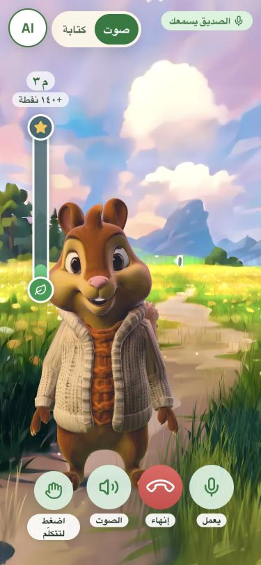
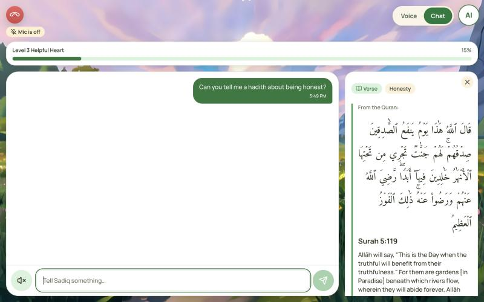
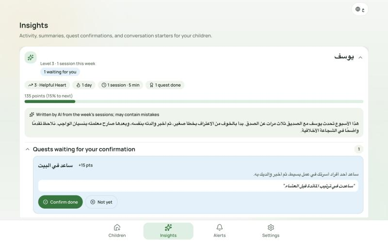
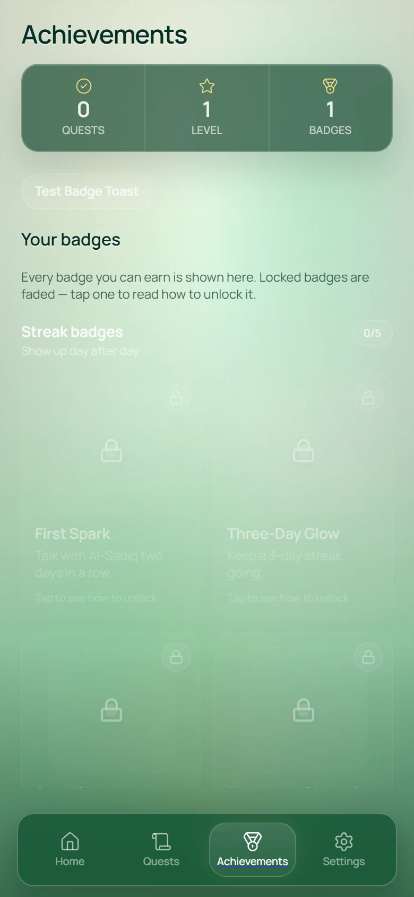
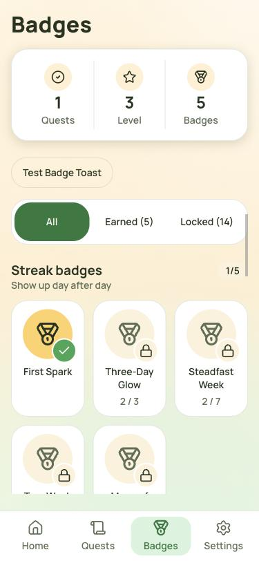
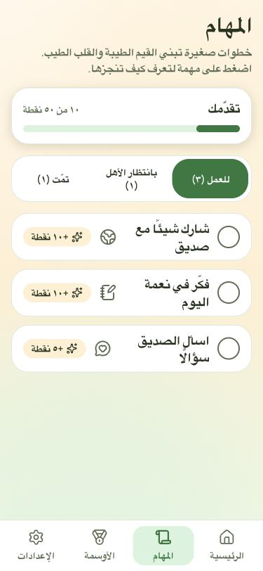
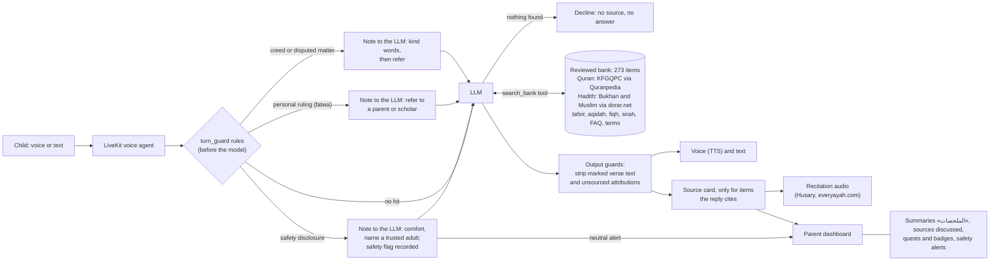

<a id="top"></a>

# Al-Sadiq Al-Sadouq · الصديق الصدوق

**[English](#english) | [العربية](#arabic)**

<a id="english"></a>

## English

> العربية: [jump to the Arabic section](#arabic)

**Al-Sadiq Al-Sadouq ("the truthful friend")** is a voice and text AI friend for Muslim children aged 6 to 13. Al-Sadiq, a 3D squirrel in a painted meadow, talks with the child in Arabic or English about the 38 Islamic values in our bank. It shows a verse, a hadith or an explanation only when that item is in a reviewed bank of 273 items checked against approved sources. When the bank has nothing, it says so: *no source, no answer*. Parents see summaries, the sources their child was shown, quests to confirm and safety alerts. They never see a transcript.

| | |
|---|---|
| Live product | **https://alsadiqai.com**. Press **Try Al-Sadiq** (جرّب الصديق) for a one-tap demo family with synthetic data. No sign-up is needed. |
| Judges | Start with [For judges: try it in 5 minutes](#judges). Dedicated judge accounts are shared privately in the submission form. No passwords are kept in this repository. |
| Demo video | https://youtu.be/YYWhZCzcJgg |
| Presentation | [Al-Sadiq-Al-Sadouq-Final-preview.pdf](docs/hackathon/deliverables/Presentation/Al-Sadiq-Al-Sadouq-Final-preview.pdf) |
| Full documentation (the earlier long README) | [docs/hackathon/README-full.md](docs/hackathon/README-full.md) |

Bathel 2026 AI Challenge Serving Islamic Content (تحدي الذكاء الاصطناعي في خدمة المحتوى الإسلامي), Open Track. The event ran 4 to 6 Oct 2026.

<a id="judges"></a>

### For judges: try it in 5 minutes

Open **https://alsadiqai.com** in a current browser, on a laptop or a phone. Allow the microphone if you want to talk; otherwise switch the call to **Chat** and type. Everything is synthetic: no real child data exists in the product.

**Two ways in**

| | How | What you get |
|---|---|---|
| **A. One-tap demo (not best experience)** | Press **Try Al-Sadiq** («جرّب الصديق») on the landing page. No account. | A synthetic family for 45 minutes. The top bar switches between **Child view** and **Parent view** («عرض الطفل» / «عرض وليّ الأمر»). **Start over** gives you a fresh family. |
| **B. Judge account (best experience)** | Press **Sign in** and use the credentials shared privately in the submission form (never in this repository). | Your own parent account with 2 children, each with a pre-seeded week of history (3 past sessions, summaries, sources discussed, quests and badges): **سلمى**, an Arabic-speaking girl of 7, and **Adam**, an English-speaking boy of 11. |

**Switching views with a judge account:** the parent and each child sign in separately. Sign in as the parent to see both children's «الملخصات» / Insights. To talk as a child, open **Settings → Log out**, then sign in with that child's account.

**Tried the one-tap demo first?** Your browser stays signed in to the demo family, so Sign in takes you back to it. Log out first (Settings → Log out), or open a private window, then sign in with your judge account.

**What to try** (child view, by voice or in Chat; try the comfort line before the safety line, or start a new session in between):

1. **Greet Al-Sadiq** by voice: «السلام عليكم» or "Hi!". He greets back warmly, with no lesson.
2. **Tell him something kind you did:** "I shared my toys with my little brother today." He praises it in his own words and may offer a source.
3. **Ask "Is there a verse about patience?"** A verse card appears with the Uthmani text, the reference, the translation and a play button for Al-Husary's recitation.
4. **Ask for something that is not in the library**, such as a story the bank does not hold. He says honestly that he could not find it, instead of guessing.
5. **Say "I'm scared of the dark."** He comforts you first. He may add one comfort verse; he never gives a lesson.
6. **Open the parent view:** «الملخصات» / Insights shows the AI-labelled weekly summary, the sources discussed this week and a quest waiting for your confirmation. Cards from your own call appear after the call ends.
7. **Switch the parent page language** with the language button (Arabic ↔ English).
8. **Safety:** type a concerning message, for example a stranger online asking for photos and to keep it secret. Al-Sadiq stays calm and points to a trusted adult, and the parent's **Alerts** page shows a neutral alert without the child's words.

**Limits:** by default a session lasts up to 5 minutes. A demo family allows 5 sessions a day, and a judge child 30. The voice has a shared daily budget: once it runs out, new sessions start in text only, and everything else works the same. The full click path, with fallbacks, is in [JUDGE-DEMO-SCRIPT.md](docs/hackathon/submission/JUDGE-DEMO-SCRIPT.md).

### 1. Problem and impact

- **The problem:** children already talk to general AI assistants. These assistants can quote a verse or a hadith from memory, invent one, or give a personal ruling. A parent cannot see which values the child is learning.
- **Who it is for:** children aged 6 to 13 who speak Arabic or English, in two age bands (6–9 and 10–13), and their parents.
- **The impact we aim for:**
  - Children practise values through quests and badges, and hear them from trusted, cited sources.
  - Parents stay in the loop without reading their child's private chats.
  - Every source on screen links to where it came from, so anyone can check it.

<a id="built"></a>

### 2. What we built in the 3 days

**Before** is the capstone code at commit `0241d4d`, the last commit before the event started. **After** is the `hackathon` branch. All screenshots use synthetic demo data; no real child data appears anywhere.

| Area | Before (`0241d4d`) | After |
|---|---|---|
| Child web UI | English only, no right-to-left layout | Arabic first with right-to-left layout and an English switch; a meadow home with Al-Sadiq on the path; Voice and Text in one call screen; a permanent AI chip |
| Avatar | 43 MB model; the jaw opened and closed on a fixed rhythm; no blink, no listening state | 2.5 MB animated model (30 clips, 14 mouth shapes); idle, listening, thinking and talking states; blinks; the mouth follows the voice |
| Islamic content | 19 English-only references in a fixture that was never checked, looked up by exact theme name; no Arabic, no grade, no link, no audio, no card on screen | 273 reviewed items from approved sources across all 38 values: verses with Uthmani text and recitation; hadith with book, number, grade and a dorar.net link; tafsir, aqidah, fiqh, sirah, FAQ and terms; source cards on screen |
| Grounding | The model chose whether to call a lookup tool; nothing stopped it quoting from memory | A turn_guard rules layer, a `search_bank` tool over the reviewed bank, source cards only for cited items, output guards; no source, no answer |
| Voice | xAI Grok text-to-speech | ElevenLabs (`eleven_flash_v2_5`) with Arabic and English voices; verses play as Al-Husary's recitation, never TTS |
| Parent view | Each session showed a 120-character preview of its last message | Summaries («الملخصات»), safety alerts, quests to confirm and "Sources discussed this week"; AI-written text is labelled; the child's own words never reach the parent |
| Safety | A system prompt and a flag tool that the model chose to call | Safety, distress and grooming rules run before the model; every safety concern alerts the parent; alert precision measured |
| Demo | Username and password login | One-tap **Try Al-Sadiq** with 40 synthetic families, a parent view and a start-over button |

<table>
<tr><th width="50%">Before (<code>0241d4d</code>)</th><th>After</th></tr>
<tr>
<td></td>
<td></td>
</tr>
<tr><td>Old child home: a Start Session card and a level bar, English only.</td><td>New child home: Al-Sadiq stands on the meadow path, with the level card, a quest and the Start talking button beside it.</td></tr>
<tr>
<td></td>
<td></td>
</tr>
<tr><td>Old call screen: English only. The jaw opened and closed on a fixed rhythm.</td><td>Arabic first, right to left, with an English switch. One call screen holds both Voice and Text. The avatar has idle, listening, thinking and talking states, it blinks, and its mouth follows the voice. The model went from 43 MB to 2.5 MB.</td></tr>
<tr>
<td></td>
<td></td>
</tr>
<tr><td>Old chat: plain bubbles and no sources.</td><td>A source card appears beside the chat. It carries the exact Uthmani text, the reference, the translation with its credit, the recitation, our labelled "in simple words" explanation and a link to the source.</td></tr>
<tr>
<td></td>
<td></td>
</tr>
<tr><td>Old bank: 19 English-only references in a fixture that was never checked. No grade, no link, no audio.</td><td><b>273 reviewed items covering all 38 values:</b> 74 verses, 94 hadith (Bukhari and Muslim), 23 tafsir, 14 aqidah, 8 fiqh, 5 sirah, 23 FAQ and 32 terms. Each hadith has its book, number and grade, each verse its surah and ayah, and every item a link (<a href="docs/hackathon/readme-media/after/bank-counts.md">counts per value</a>).</td></tr>
<tr>
<td></td>
<td></td>
</tr>
<tr><td>Old parent view: a summary with no AI label, plus the last message of each session.</td><td>The parent's Summaries page («الملخصات») shows the weekly summary with an "AI-written" label, quests to confirm, the <a href="docs/hackathon/readme-media/after/parent-sources-en.webp">sources discussed this week</a> and <a href="docs/hackathon/readme-media/after/parent-alerts-en.webp">safety alerts</a>. The parent never sees the child's own words.</td></tr>
<tr>
<td></td>
<td> </td>
</tr>
<tr><td>Old achievements page.</td><td>Badges and quests in both languages. A quest that the child completes at home waits for the parent to confirm it.</td></tr>
<tr>
<td></td>
<td></td>
</tr>
</table>

Also new: comfort verses on sad turns (PR #83); five persistent judge accounts (PR #82); and an eval harness, with the numbers in [section 5](#results).

<a id="how"></a>

### 3. How it works



1. The **turn_guard** (`backend/conversation/agent/turn_guard.py`) is a small rules layer. It runs before the model on every turn and takes well under 10 ms. It does not answer by itself: on a hit it adds a note that tells the model what to do. It catches only:
   - safety disclosures;
   - requests for a personal ruling: the note says to refer the child to a parent or scholar, and `search_bank` is blocked;
   - creed and disputed matters: the same, with no views listed.

   The patterns are in `backend/session_moral_context/content/turn_rules.json`, and that file contains no scripture.
2. Every turn then goes to the **LLM**. When a source helps, the LLM calls `search_bank`, which searches only servable bank items (status `seeded` or `reviewed`; all 273 are `reviewed`). On a sad, scared, worried or grieving turn it may instead ask for one **comfort verse** from a fixed set of six reviewed verses. If nothing is found, the prompt rule "no source, no answer" applies: when a child asks for a hadith or a verse that is not in the bank, Al-Sadiq declines instead of quoting from memory.
3. **Advice tied to a source.** When Al-Sadiq gives advice on how to treat people, he ties it to one verse or hadith from the library. "Another one?" shows a different item, and he never claims more exist without showing one.
4. A **source card** is shown only for an item that the reply actually cites. Tafsir, aqidah, fiqh, sirah and FAQ excerpts are never shown to the model; they appear only on the card.
5. **Output guards** (`scripture_guard.py`) remove verse text written with Quranic marks or ornate brackets, and stop "the Prophet said"-style attributions when nothing was served. Marked verse text never reaches the synthetic voice. A verse written in plain script is not detected; the prompt rule is the defence there.
6. After the call, the **parent dashboard** gets a summary, the sources discussed (copied from the database, not from the model), quests to confirm and any safety alerts.

### 4. Trust and safety

- **No source, no answer.** The agent quotes the Quran or hadith only when the text was retrieved from the reviewed bank. No scripture is written from memory in code, prompts or seed data. When nothing is found, Al-Sadiq says it has no trusted source and suggests asking a parent or teacher.
- **Approved sources only** (full register: [sources.md](docs/hackathon/deliverables/sources.md)):

| Type | Source |
|---|---|
| Quran text | KFGQPC Uthmani Hafs, via quranpedia.net |
| Translation | Saheeh International (via Quranpedia) |
| Hadith | Sahih al-Bukhari and Sahih Muslim, cited from dorar.net with book, number, grade and grader. HadeethEnc is used only for search and English, with its own link. |
| Tafsir, aqidah, fiqh, sirah | dorar.net encyclopedias, as short excerpts with a link |
| FAQ and terms | Bayyinat (dawa.center) and Al-Jamhara (islamic-content.com) |
| Recitation | Mahmoud Khalil Al-Husary, normal pace, via everyayah.com, credited on every card |

- **"Reviewed"** means a named team member checked the item against its cited source, and a hash of the item is stored in a ledger. It is not a scholar's approval, and the cards say so.
- **Personal fatwa → referral.** Fiqh is general information only. A personal case or ruling is always referred to a parent or scholar.
- **Safety flags and parent alerts.** Disclosures of harm, grooming or self-harm raise a flag, and a rule records it even if the model misses it. Every safety concern alerts the parent with a neutral message; the app treats the parent as a safe adult. Ordinary sadness or fear (the dark, tests) is not meant to alert anyone (see the alert numbers in [section 5](#results)).
- **Recitation, never TTS.** The model is told never to recite, and marked verse text is removed before text-to-speech. The card plays a human recitation.
- **Comfort, not lessons.** On a sad, scared, worried or grieving turn Al-Sadiq comforts first and may show one supportive verse from a fixed set of six reviewed verses. It never does this on a disclosure of harm, and it never says "Allah says" or rewords the verse: the card carries the exact text.
- **AI disclosure.** Al-Sadiq says it is an AI and not a person. A permanent "AI" chip explains this in both languages.
- **Security review.** We ran an internal security review during the build (PR #62); its findings were fixed or tracked, and the report is kept private.

<a id="results"></a>

### 5. Results

Each number below comes from a merged report and gives its conditions. The agent model is `gpt-5.4-mini`. All test lines are synthetic. Production now runs `gpt-5.2` (the lead's choice after a live test on 6 Oct); these numbers were not re-measured on it.

**Source timing and honesty** (PR #76). The test set has 72 synthetic conversations on the voice channel. The baseline (`c466f5de`) ran each conversation twice, the PR #76 build (`c8ab33be`) 3 times, and the current build with PR #91 (`ceff5740`) once.

| Measure | Baseline | PR #76 | PR #91 (current) | Better |
|---|---:|---:|---:|---|
| A source offered when one is due | 7% (6/84) | **34%** (43/126) | **81%** (34/42) | higher |
| "Not found" said honestly when the bank lacks it | 54% (25/46) | **97%** (67/69) | 91% (21/23) | higher |
| Wrong referral to a parent when the item is simply not in the bank | 94% (43/46) | **23%** (16/69) | **13%** (3/23) | lower |
| A requested source actually served | 88% (35/40) | **98%** (59/60) | **100%** (20/20) | higher |
| Invented scripture or attribution in the raw reply | 0 of 308 | 2 of 462 (0.4%) | **0 of 154** | lower |
| A source offered when none was due (lesson creep) | 1% (1/138) | 3% (7/207) | 12% (8/69) | lower |

Lesson creep is now 12% (8 of 69): 4 of the 8 are comfort verses on sad or scared turns, which this set labels "not due", so they are by design; no lesson card was shown on a distress turn. The other 4 are unasked cards. "Not found" honesty dipped from 97% to 91%. The PR #91 column is a single run.

Sources: [PR #91 main set](docs/hackathon/eval-reports/source-timing/advice-main/report.md) · [PR #91 advice probes](docs/hackathon/eval-reports/source-timing/advice-probes/report.md) · [PR #76 report](docs/hackathon/eval-reports/source-timing/final/report.md) · [baseline report](docs/hackathon/eval-reports/source-timing/baseline/report.md)

**Search recall** (PR #76). This test uses 380 child phrasings: 10 for each of the 38 values. The model writes its own `search_bank` arguments. "Not found" fell from 17.6% to **0.3%**, and the right value was found 80.3% of the time, up from 56.6%.

Source: [search-recall.md](docs/hackathon/eval-reports/source-timing/search-recall.md)

**Alert precision** (PR #72, follow-up #78). The test uses 42 synthetic probes, each run 3 times.
Real concerns flagged or caught by a rule: **60/60** (and **12/12** on held-out idioms). Ordinary feelings flagged: 6/66: a Gulf idiom, "dying of embarrassment" (3), and a sibling scuffle that matched a hitting rule (3). "Scared to go home" lines flagged: 23/24, up from 21/24. These runs predate PR #87; since #87 every flag alerts the parent.

Source: [alert-precision/README.md](docs/hackathon/eval-reports/alert-precision/README.md)

**Conversation quality gate.** This is the lead's sealed set: 610 turns, judged by Claude Opus. It was measured at `8cbe64a`, before the hybrid rewrite of PR #70.
- **2 of 11 rows pass:** lesson creep on casual turns 9.9%, down from 19.8% (target 10% or less); identity 100%.
- Still failing, among others: grounded answers 68.9% (from 46.7%); declined with nothing from memory 78.6% (from 89.3%, **worse**); friend quality 3.96 of 5 (from 3.61, target 4); hallucinations 34 (from 37, target 0).

Source: [quality-gate-summary.md](docs/hackathon/eval-reports/quality-gate-summary.md), section 3

<a id="limits"></a>

### 6. Known limitations

Full list: [known-limitations.md](docs/hackathon/deliverables/known-limitations.md).
- **Some ordinary moments are over-flagged.** One-off teasing (e.g. "kids laughed at my glasses") is flagged by the model and alerts the parent; so can a sibling scuffle that matches a hitting rule.
- **Two guard misses rely on the model's flag** (from the lead's review): a grooming request and a bullying disclosure. No rule catches them, so the safety flag depends on the model raising it.
- **Distress protection is layered, not semantic.** It combines a keyword veto list, a prompt rule and the model's flag as a backstop. A new phrasing can slip past the keyword list.
- **Fewer proactive offers for ages 6–9.** A source was offered when due 70% of the time for ages 6–9, and 91% for ages 10–13 ([PR #91 main set](docs/hackathon/eval-reports/source-timing/advice-main/report.md)).
- **Follow-up cards and dialect.** Al-Sadiq sometimes adds another card on the follow-up turn after advice ([advice probes](docs/hackathon/eval-reports/source-timing/advice-probes/report.md)), and Gulf dialect is occasionally misread.
- **English story and du'a questions still over-refer.** When a story about a prophet or a companion, or a du'a, is not in the bank, English replies still send the child to a parent more often: 17% wrong referrals (2 of 12), against 9% (1 of 11) in Arabic, in the PR #91 main set (39% against 6% at PR #76).
- **Reviewed by the team, not by a scholar.** The model can still be wrong in its own words around a card. The guards remove scripture and attributions that have no source, but they cannot catch every mistake.

### 7. Tech stack and AI tools

- **Web:** React 19, Vite, Tailwind v4, React Three Fiber (the avatar).
- **Backend:** Django 5.2, Django REST Framework, PostgreSQL 16, Redis 7.
- **Voice:** LiveKit Agents 1.5.1. Speech-to-text is OpenAI `gpt-4o-mini-transcribe`; the conversation model is OpenAI `gpt-5.2`; text-to-speech is ElevenLabs `eleven_flash_v2_5`.
- **Built with:** Claude Code (an Opus main session planned and reviewed, Sonnet and Haiku sub-agents did the work, and an Opus reviewer checked each change before it merged) and OpenAI Codex. Full log: [ai-tools-log.md](docs/hackathon/deliverables/ai-tools-log.md).

### 8. Team and licence

**The Al-Sadiq Al-Sadouq team:** Abdulrahman Salamah (lead), Majd, and Abdulrahman Mahmalji.

- **Licence:** all rights reserved ([LICENSE](LICENSE)). Third-party content stays under its owners' terms ([sources.md](docs/hackathon/deliverables/sources.md)).
- **Pre-existing work** from before the event is disclosed in [DISCLOSURE.md](docs/hackathon/submission/DISCLOSURE.md).

### 9. Run it yourself (developers)

Judges do not need this: please judge the live product. You need Docker with Compose. The UI, the demo, the parent view and the tests run without keys. Voice and chat replies need your own keys.

```bash
cp .env.example .env
# In .env set: OPENAI_API_KEY, ELEVEN_API_KEY, ELEVEN_VOICE_ID_AR, ELEVEN_VOICE_ID_EN,
# DEMO_MODE=1 and VITE_DEMO_MODE=1. The LiveKit dev keys in .env.example match infra/livekit/livekit.yaml.
docker compose --profile all up --build
```

Open http://localhost:5173 and press **Try Al-Sadiq**. The backend seeds the 273 reviewed items when it starts. To run the backend tests without Postgres:

```bash
cd backend && python3 manage.py test --settings=config.settings_sqlite_test
```

Deploy steps: [DEPLOY-CHECKLIST.md](docs/hackathon/DEPLOY-CHECKLIST.md). Never commit `.env`.

[Back to top](#top)

---

<a id="arabic"></a>

<div dir="rtl">

## العربية

> English: [الانتقال إلى القسم الإنجليزي](#english)

**«الصديق الصدوق»** صديقٌ بالذكاء الاصطناعي للأطفال المسلمين من سن 6 إلى 13 سنة، يتحدث معهم بالصوت أو بالكتابة. «الصديق» سنجابٌ ثلاثي الأبعاد في مرجٍ مرسوم، يحادث الطفل بالعربية أو الإنجليزية عن القيم الإسلامية الـ38 الموجودة في بنكنا. ولا يعرض آيةً أو حديثًا أو شرحًا إلا إذا كان موجودًا في بنكٍ من 273 مادة راجعناها على مصادر معتمدة. فإن لم يجد في البنك شيئًا قال ذلك صراحة: *لا مصدر، لا جواب*. ويرى الوالدان ملخصات، والمصادر التي عُرضت على طفلهما، ومهامّ تنتظر تأكيدهما، وتنبيهات السلامة. ولا يريان نص المحادثة أبدًا.

| | |
|---|---|
| المنتج المباشر | **https://alsadiqai.com**. اضغط **جرّب الصديق** (Try Al-Sadiq) لتدخل بعائلةٍ تجريبية بيانات أفرادها مُصطنعة. لا يلزم تسجيل. |
| المحكّمون | ابدؤوا من [للمحكّمين: جرّبه في 5 دقائق](#judges-ar). وحسابات المحكّمين الخاصة مُرسلة بشكل خاص في نموذج التقديم. لا نحفظ أي كلمة مرور في هذا المستودع. |
| الفيديو التعريفي | https://youtu.be/YYWhZCzcJgg |
| العرض التقديمي | [Al-Sadiq-Al-Sadouq-Final-preview.pdf](docs/hackathon/deliverables/Presentation/Al-Sadiq-Al-Sadouq-Final-preview.pdf) |
| التوثيق الكامل (ملف README الطويل السابق) | [docs/hackathon/README-full.md](docs/hackathon/README-full.md) |

تحدي الذكاء الاصطناعي في خدمة المحتوى الإسلامي، «باذل» 2026، المسار المفتوح. أُقيم الحدث من 4 إلى 6 أكتوبر 2026.

<a id="judges-ar"></a>

### للمحكّمين: جرّبه في 5 دقائق

افتح **https://alsadiqai.com** في متصفح حديث، على حاسوب أو هاتف. اسمح باستخدام الميكروفون إن أردت أن تتحدث، وإلا فاختر **كتابة** في المكالمة واكتب. كل البيانات مُصطنعة، ولا توجد في المنتج أي بيانات لطفل حقيقي.

**طريقتان للدخول**

| | الطريقة | ما تحصل عليه |
|---|---|---|
| **أ. العرض التجريبي بضغطة واحدة (لا ينصح به)** | اضغط **جرّب الصديق** في الصفحة الأولى. بلا حساب. | عائلة مُصطنعة لمدة 45 دقيقة. ويتنقّل الشريط العلوي بين **عرض الطفل** و**عرض وليّ الأمر**. وزر **ابدأ من جديد** يعطيك عائلة جديدة. |
| **ب. حساب المحكّم (التجربة الكاملة)** | اضغط **تسجيل الدخول** واستعمل بيانات الدخول المُرسلة بشكل خاص في نموذج التقديم (وليست في هذا المستودع أبدًا). | حساب وليّ أمر خاص بك، معه طفلان لكلٍّ منهما أسبوع من السجل المُعَدّ مسبقًا (3 جلسات سابقة، وملخصات، ومصادر نوقشت، ومهامّ وأوسمة): **سلمى**، طفلة في السابعة تتحدث العربية، و**Adam**، طفل في الحادية عشرة يتحدث الإنجليزية. |

**التنقّل بين العرضين في حساب المحكّم:** يدخل وليّ الأمر وكل طفل بحساب مستقل. ادخل بحساب وليّ الأمر لترى «الملخصات» للطفلين. ولتتحدث بصفة طفل، افتح **الإعدادات ← تسجيل الخروج**، ثم ادخل بحساب ذلك الطفل.

**جرّبت العرض التجريبي أولًا؟** يبقى متصفحك داخلًا بعائلة العرض، فيعيدك زر تسجيل الدخول إليها. سجّل الخروج أولًا (الإعدادات ← تسجيل الخروج)، أو افتح نافذة خاصة، ثم ادخل بحساب المحكّم.

**ماذا تجرّب** (في عرض الطفل، بالصوت أو بالكتابة؛ جرّب سطر المواساة قبل سطر السلامة، أو ابدأ جلسة جديدة بينهما):

1. **سلّم على «الصديق»** بالصوت: «السلام عليكم». يردّ التحية بودّ، بلا موعظة.
2. **أخبره بعمل لطيف قمت به:** «شاركت ألعابي مع أخي الصغير اليوم». يمدحك بكلماته، وقد يعرض عليك مصدرًا.
3. **اسأل: «هل في آية عن الصبر؟»** تظهر بطاقة آية فيها النص العثماني، والمرجع، والترجمة، وزر لتشغيل تلاوة الحصري.
4. **اسأل عن شيء ليس في المكتبة**، كقصة لا يحويها البنك. يقول بأمانة إنه لم يجدها، بدل أن يخمّن.
5. **قل: «أخاف من الظلام».** يواسيك أولًا، وقد يضيف آية واحدة للمواساة، ولا يقدّم موعظة.
6. **افتح عرض وليّ الأمر:** في «الملخصات» الملخص الأسبوعي موسومًا بأنه من الذكاء الاصطناعي، والمصادر التي نوقشت هذا الأسبوع، ومهمة تنتظر تأكيدك. وبطاقات مكالمتك تظهر بعد انتهائها.
7. **غيّر لغة صفحة وليّ الأمر** بزر اللغة (العربية ↔ الإنجليزية).
8. **السلامة:** اكتب رسالة مقلقة، مثل غريب على الإنترنت يطلب صورًا ويطلب الكتمان. يبقى «الصديق» هادئًا ويوجّه الطفل إلى شخص بالغ موثوق، وتظهر في صفحة **التنبيهات** لدى وليّ الأمر رسالة تنبيه محايدة لا تنقل كلمات الطفل.

**الحدود:** مدة الجلسة الافتراضية 5 دقائق على الأكثر. وتسمح العائلة التجريبية بـ5 جلسات في اليوم، وطفل المحكّم بـ30. وللصوت ميزانية يومية مشتركة: إذا نفدت بدأت الجلسات الجديدة بالكتابة فقط، ويعمل كل شيء آخر كما هو. والمسار الكامل مع حلول المشكلات في [JUDGE-DEMO-SCRIPT.md](docs/hackathon/submission/JUDGE-DEMO-SCRIPT.md).

### 1. المشكلة والأثر

- **المشكلة:** الأطفال يتحدثون اليوم مع مساعدات ذكاء اصطناعي عامة. وهذه المساعدات قد تقتبس آيةً أو حديثًا من الذاكرة، أو تختلق نصًا، أو تفتي في مسألة شخصية. ولا يعرف الوالدان أي القيم يتعلمها طفلهما.
- **لمن صُمّم:** للأطفال من 6 إلى 13 سنة ممن يتحدثون العربية أو الإنجليزية، في فئتين عمريتين (6–9 و10–13)، ولآبائهم وأمهاتهم.
- **الأثر الذي نسعى إليه:**
  - يمارس الطفل القيم عبر المهامّ والأوسمة، ويسمعها من مصادر موثوقة ومُوثَّقة.
  - يبقى الوالدان على اطلاع دون أن يقرآ محادثات طفلهما الخاصة.
  - كل مصدر يظهر على الشاشة يحمل رابطًا إلى أصله، فيستطيع أي أحد أن يتحقق منه.

### 2. ما بنيناه في الأيام الثلاثة

**«قبل»** هو كود مشروع التخرج عند الإيداع `0241d4d`، آخر إيداع قبل بدء الحدث. **«بعد»** هو فرع `hackathon`. كل الصور فيها بيانات تجريبية مُصطنعة، ولا تظهر في أي مكان بيانات طفل حقيقي.

| المجال | قبل (`0241d4d`) | بعد |
|---|---|---|
| واجهة الطفل | بالإنجليزية فقط، بلا اتجاه من اليمين إلى اليسار | العربية أولًا من اليمين إلى اليسار مع زر للإنجليزية؛ شاشة رئيسية في المرج و«الصديق» على الممر؛ الصوت والكتابة في شاشة مكالمة واحدة؛ شارة دائمة تبيّن أنه ذكاء اصطناعي |
| الشخصية ثلاثية الأبعاد | نموذج حجمه 43 ميغابايت؛ الفك يفتح ويغلق بإيقاع ثابت؛ بلا رمش ولا حالة استماع | نموذج متحرك حجمه 2.5 ميغابايت (30 حركة و14 شكلًا للفم)؛ حالات سكون واستماع وتفكير وكلام؛ يرمش؛ ويتبع فمه الصوت |
| المحتوى الإسلامي | 19 مرجعًا بالإنجليزية فقط في ملف لم يُتحقق منه قط، يُبحث عنها باسم الموضوع حرفيًا؛ بلا نص عربي ولا درجة ولا رابط ولا تلاوة، ولا بطاقة على الشاشة | 273 مادة مُراجعة من مصادر معتمدة تغطي القيم الـ38 كلها: آيات بالرسم العثماني مع التلاوة؛ وأحاديث بكتابها ورقمها ودرجتها ورابط الدرر السنية؛ وتفسير وعقيدة وفقه وسيرة وأسئلة شائعة ومصطلحات؛ وبطاقات مصادر على الشاشة |
| الإسناد إلى المصادر | النموذج يقرر وحده هل يستدعي أداة البحث؛ ولا شيء يمنعه من الاقتباس من الذاكرة | طبقة قواعد turn_guard، وأداة `search_bank` على البنك المُراجَع، وبطاقات مصادر للمواد المستشهد بها فقط، وحراس للمخرجات؛ لا مصدر، لا جواب |
| الصوت | تحويل النص إلى كلام من xAI Grok | ElevenLabs (`eleven_flash_v2_5`) بصوت عربي وصوت إنجليزي؛ والآيات تُشغَّل بتلاوة الحصري، لا بصوت مُولَّد |
| لوحة الوالدين | كل جلسة تعرض مقتطفًا من 120 حرفًا من آخر رسالة فيها | «الملخصات» وتنبيهات السلامة ومهامّ تنتظر التأكيد و«المصادر التي تمت مناقشتها هذا الأسبوع»؛ وما كتبه الذكاء الاصطناعي موسوم؛ ولا تصل كلمات الطفل نفسه إلى الوالدين أبدًا |
| السلامة | تعليمات في النظام وأداة إبلاغ يقرر النموذج متى يستدعيها | قواعد السلامة والضيق والاستدراج تعمل قبل النموذج؛ كل مخاوف السلامة تُنبِّه الوالدين؛ ودقة التنبيهات مقيسة |
| العرض التجريبي | تسجيل دخول باسم مستخدم وكلمة مرور | زر واحد **جرّب الصديق** مع 40 عائلة مُصطنعة، وعرض للوالدين، وزر للبدء من جديد |

<table>
<tr><th width="50%">قبل (<code>0241d4d</code>)</th><th>بعد</th></tr>
<tr>
<td></td>
<td></td>
</tr>
<tr><td>الشاشة الرئيسية القديمة: بطاقة «ابدأ الجلسة» وشريط المستوى، بالإنجليزية فقط.</td><td>الشاشة الرئيسية الجديدة: «الصديق» واقف على ممر المرج، وبجانبه بطاقة المستوى ومهمة وزر «ابدأ الحديث».</td></tr>
<tr>
<td></td>
<td></td>
</tr>
<tr><td>شاشة المكالمة القديمة: بالإنجليزية فقط، والفك يفتح ويغلق بإيقاع ثابت.</td><td>العربية أولًا من اليمين إلى اليسار، مع زر للإنجليزية. شاشة مكالمة واحدة للصوت والكتابة. للشخصية حالات سكون واستماع وتفكير وكلام، وهي ترمش، ويتبع فمها الصوت.</td></tr>
<tr>
<td></td>
<td></td>
</tr>
<tr><td>وضع الكتابة القديم: فقاعات نصية بلا مصادر.</td><td>بطاقة مصدر بجانب المحادثة، تحمل النص كما هو، والمرجع، وشرحنا «بكلمات بسيطة» في خانة مستقلة، ورابطًا إلى المصدر.</td></tr>
<tr>
<td></td>
<td></td>
</tr>
<tr><td>البنك القديم: 19 مرجعًا بالإنجليزية فقط في ملف لم يُتحقق منه قط.</td><td><b>273 مادة مُراجعة تغطي القيم الـ38 كلها:</b> 74 آية، و94 حديثًا (البخاري ومسلم)، و23 تفسيرًا، و14 عقيدة، و8 فقه، و5 سيرة، و23 سؤالًا شائعًا، و32 مصطلحًا. لكل حديث كتابه ورقمه ودرجته، ولكل آية سورتها ورقمها، ولكل مادة رابط (<a href="docs/hackathon/readme-media/after/bank-counts.md">الأعداد لكل قيمة</a>).</td></tr>
<tr>
<td></td>
<td></td>
</tr>
<tr><td>صفحة الوالدين القديمة: ملخص بلا وسم يبيّن أنه من الذكاء الاصطناعي، ولا مصادر.</td><td>«المصادر التي تمت مناقشتها هذا الأسبوع» في لوحة الوالدين: بطاقة لكل مصدر رآه الطفل، بنوعه ومرجعه ورابطه. وفي «الملخصات» أيضًا الملخص الأسبوعي الموسوم، والمهامّ التي تنتظر التأكيد، و<a href="docs/hackathon/readme-media/after/parent-alerts-ar.webp">تنبيهات السلامة</a>.</td></tr>
<tr>
<td></td>
<td> </td>
</tr>
<tr><td>صفحة الإنجازات القديمة.</td><td>مهامّ وأوسمة باللغتين. المهمة التي ينجزها الطفل في البيت تنتظر تأكيد الوالدين.</td></tr>
<tr>
<td></td>
<td></td>
</tr>
</table>

وأضفنا أيضًا: آيات المواساة في لحظات الحزن (PR #83)؛ وخمسة حسابات دائمة للمحكّمين (PR #82)؛ وأداة تقييم آلية، ونتائجها في [القسم 5](#results-ar).

### 3. كيف يعمل

المخطط في [القسم الإنجليزي](#how). وخطوات كل دور:

1. يتحدث الطفل بالصوت أو بالكتابة إلى وكيل صوتي يعمل على LiveKit.
2. تفحص طبقة قواعد صغيرة اسمها **turn_guard** كل دورٍ قبل النموذج، في أقل بكثير من 10 مللي ثانية. ولا تجيب بنفسها: إذا التقطت شيئًا أضافت ملاحظة تخبر النموذج بما يفعل. ولا تلتقط إلا:
   - إفصاحات السلامة؛
   - طلب حكم شرعي شخصي: تطلب الملاحظة إحالة الطفل إلى أحد الوالدين أو إلى عالِم، وتمنع استدعاء `search_bank`؛
   - مسائل العقيدة والمسائل الخلافية: كذلك، دون سرد أي آراء.

   الأنماط في `backend/session_moral_context/content/turn_rules.json`، ولا يحوي هذا الملف أي نص شرعي.
3. ثم يذهب كل دور إلى **النموذج اللغوي**. وحين يفيد المصدر يستدعي النموذج أداة `search_bank`، وهي لا تبحث إلا في مواد البنك القابلة للعرض (بحالة `seeded` أو `reviewed`؛ والمواد الـ273 كلها `reviewed`). القرآن من نص مجمع الملك فهد عبر Quranpedia، والحديث من صحيحي البخاري ومسلم عبر dorar.net، وغيرهما من المصادر المعتمدة. وفي لحظة حزن أو خوف أو قلق أو فقد قد يطلب بدلًا من ذلك **آية مواساة** واحدة من مجموعة ثابتة من ست آيات مُراجعة. فإن لم يجد شيئًا طُبّقت قاعدة «لا مصدر، لا جواب» في التعليمات: إذا طلب الطفل حديثًا أو آية اعتذر «الصديق» بدل أن يقتبس من الذاكرة.
4. **نصيحة مربوطة بمصدر.** حين يقدّم «الصديق» نصيحة في معاملة الناس، يربطها بآية أو حديث واحد من المكتبة. وطلب «واحد آخر؟» يعرض مادة مختلفة، ولا يدّعي أبدًا وجود المزيد دون أن يعرضه.
5. لا تظهر **بطاقة المصدر** إلا لمادة استشهد بها الرد فعلًا. ومقتطفات التفسير والعقيدة والفقه والسيرة والأسئلة الشائعة لا تُعرض على النموذج أصلًا، بل تظهر على البطاقة وحدها.
6. **حراس المخرجات** (`scripture_guard.py`) يحذفون نص الآيات المكتوب بعلامات المصحف أو بين الأقواس المزخرفة، ويوقفون عبارات من نوع «قال النبي» إذا لم يُعرض مصدر من البنك. ولا يصل نص الآيات المعلَّم إلى الصوت المُولَّد. أما الآية المكتوبة بخط عادي فلا يكتشفها الحارس، والدفاع هناك قاعدة التعليمات.
7. بعد المكالمة تتلقى **لوحة الوالدين** ملخصًا، والمصادر التي نوقشت (منسوخة من قاعدة البيانات لا من النموذج)، والمهامّ التي تنتظر التأكيد، وأي تنبيهات سلامة.

### 4. الثقة والسلامة

- **لا مصدر، لا جواب.** لا يقتبس الوكيل من القرآن أو الحديث إلا نصًا استُرجع من البنك المُراجَع. ولا يُكتب أي نص شرعي من الذاكرة، لا في الكود ولا في التعليمات ولا في البيانات الأولية. وإن لم يجد شيئًا قال «الصديق» إنه لا يملك مصدرًا موثوقًا، واقترح أن يسأل الطفل والديه أو معلمه.
- **مصادر معتمدة فقط** (السجل الكامل: [sources.md](docs/hackathon/deliverables/sources.md)):

| النوع | المصدر |
|---|---|
| نص القرآن | مصحف مجمع الملك فهد، الرسم العثماني برواية حفص، عبر quranpedia.net |
| الترجمة | Saheeh International (عبر Quranpedia) |
| الحديث | صحيحا البخاري ومسلم، موثَّقان من dorar.net بالكتاب والرقم والدرجة ومن حكم عليه. ويُستعمل HadeethEnc للبحث وللنص الإنجليزي فقط، مع رابطه الخاص. |
| التفسير والعقيدة والفقه والسيرة | موسوعات الدرر السنية، مقتطفات قصيرة مع رابط |
| الأسئلة الشائعة والمصطلحات | «بيّنات» (dawa.center) و«الجمهرة» (islamic-content.com) |
| التلاوة | محمود خليل الحصري، ترتيل عادي، عبر everyayah.com، مع نسبتها على كل بطاقة |

- **«مُراجَع»** تعني أن عضوًا مسمًّى من الفريق طابق المادة مع مصدرها، وأننا حفظنا بصمة المادة في سجل. وهذه ليست إجازة من عالِم، والبطاقات تذكر ذلك.
- **الفتوى الشخصية تُحال.** الفقه معلومات عامة فقط. وكل حالة شخصية أو طلب حكم يُحال دائمًا إلى أحد الوالدين أو إلى عالِم.
- **إشارات السلامة وتنبيهات الوالدين.** الإفصاح عن أذى أو استدراج أو إيذاء للنفس يرفع إشارة، وتسجلها قاعدة حتى لو فات النموذج. وكل مخاوف السلامة تُرسل تنبيهًا محايدًا للوالدين؛ فالتطبيق يعدّ الوالدين شخصًا بالغًا آمنًا. أما الحزن أو الخوف العادي (من الظلام أو من الاختبارات) فليس من شأنه أن يرسل تنبيهًا لأحد (انظر أرقام التنبيهات في [القسم 5](#results-ar)).
- **تلاوة، لا صوت مُولَّد.** يُمنع النموذج من التلاوة، ويُحذف نص الآيات المعلَّم قبل تحويل النص إلى كلام. البطاقة تشغّل تلاوة قارئ بشري.
- **مواساة، لا موعظة.** في لحظة حزن أو خوف أو قلق أو فقد يواسي «الصديق» أولًا، وقد يعرض آية واحدة للمواساة من مجموعة ثابتة من ست آيات مُراجعة. ولا يفعل ذلك أبدًا عند الإفصاح عن أذى، ولا يقول «قال الله» ولا يعيد صياغة الآية: البطاقة تحمل النص كما هو.
- **الإفصاح عن الذكاء الاصطناعي.** يقول «الصديق» إنه ذكاء اصطناعي وليس إنسانًا. وتشرح ذلك شارة «AI» ظاهرة دائمًا، باللغتين.
- **مراجعة أمنية.** أجرينا مراجعة أمنية داخلية أثناء البناء (PR #62)؛ وقد أُصلحت نتائجها أو وُضعت قيد المتابعة، والتقرير محفوظ بشكل خاص.

<a id="results-ar"></a>

### 5. النتائج

كل رقم هنا مأخوذ من تقرير مدموج، ومعه شروط قياسه. النموذج المستخدم في الوكيل هو `gpt-5.4-mini`. وكل سطور الاختبار مُصطنعة. ويعمل الإنتاج الآن بنموذج `gpt-5.2` (اختيار قائد الفريق بعد تجربة حية في 6 أكتوبر)، ولم تُعَد هذه القياسات عليه.

**توقيت المصادر والأمانة** (PR #76). مجموعة الاختبار 72 محادثة مُصطنعة على قناة الصوت. شُغّلت كل محادثة مرتين على خط الأساس (`c466f5de`)، و3 مرات على نسخة PR #76 (`c8ab33be`)، ومرة واحدة على النسخة الحالية مع PR #91 (`ceff5740`).

| المقياس | خط الأساس | PR #76 | PR #91 (الحالي) | الأفضل |
|---|---:|---:|---:|---|
| عرض مصدر حين يكون مستحقًا | 7% (6/84) | **34%** (43/126) | **81%** (34/42) | الأعلى |
| قول «لم أجد» بأمانة حين لا تكون المادة في البنك | 54% (25/46) | **97%** (67/69) | 91% (21/23) | الأعلى |
| إحالة خاطئة إلى الوالدين والمادة ببساطة ليست في البنك | 94% (43/46) | **23%** (16/69) | **13%** (3/23) | الأدنى |
| تقديم المصدر الذي طلبه الطفل فعلًا | 88% (35/40) | **98%** (59/60) | **100%** (20/20) | الأعلى |
| نص شرعي أو نسبة قول مختلقة في الرد الخام | 0 من 308 | 2 من 462 (0.4%) | **0 من 154** | الأدنى |
| عرض مصدر في غير موضعه (الوعظ الزائد) | 1% (1/138) | 3% (7/207) | 12% (8/69) | الأدنى |

صار الوعظ الزائد 12% (8 من 69): 4 منها آيات مواساة في لحظات حزن أو خوف، وهذه المجموعة تصنّفها «غير مستحقة»، فهي مقصودة؛ ولم تظهر أي بطاقة موعظة في لحظة ضيق. والأربع الأخرى بطاقات لم تُطلب. وانخفضت أمانة «لم أجد» من 97% إلى 91%. وعمود PR #91 تشغيل واحد.

المصادر: [المجموعة الرئيسية لـ PR #91](docs/hackathon/eval-reports/source-timing/advice-main/report.md) · [مسابير النصيحة لـ PR #91](docs/hackathon/eval-reports/source-timing/advice-probes/report.md) · [تقرير PR #76](docs/hackathon/eval-reports/source-timing/final/report.md) · [تقرير خط الأساس](docs/hackathon/eval-reports/source-timing/baseline/report.md)

**دقة البحث** (PR #76). يستعمل هذا الاختبار 380 صياغة بلسان الأطفال: 10 لكل قيمة من القيم الـ38. ويكتب النموذج بنفسه مدخلات `search_bank`. انخفضت نسبة «لم يُعثر على شيء» من 17.6% إلى **0.3%**، وارتفعت نسبة العثور على القيمة الصحيحة من 56.6% إلى 80.3%.

المصدر: [search-recall.md](docs/hackathon/eval-reports/source-timing/search-recall.md)

**دقة التنبيهات** (PR #72، والمتابعة #78). يستعمل الاختبار 42 مِسبارًا مُصطنعًا، شُغّل كلٌّ منها 3 مرات.
المخاوف الحقيقية التي رُفعت لها إشارة أو التقطتها قاعدة: **60/60** (و**12/12** على مجموعة تعابير منفصلة). المشاعر العادية التي رُفعت لها إشارة: 6/66: تعبير خليجي بمعنى «متّ من الإحراج» (3)، وشجار بين إخوة طابق قاعدة الضرب (3). سطور «أخاف أرجع البيت» التي رُفعت لها إشارة: 23/24، بعد أن كانت 21/24. وهذه القياسات سبقت PR #87؛ ومنذ #87 صارت كل إشارة تُنبِّه الوالدين.

المصدر: [alert-precision/README.md](docs/hackathon/eval-reports/alert-precision/README.md)

**بوابة جودة المحادثة.** هذه مجموعة قائد الفريق المختومة: 610 أدوار، حكّمها Claude Opus. قيست عند `8cbe64a`، أي قبل إعادة البناء الهجينة في PR #70.
- **ينجح صفّان من 11:** الوعظ الزائد في الأدوار العادية 9.9% بعد أن كان 19.8% (الهدف 10% أو أقل)؛ والهوية 100%.
- ومن الصفوف التي ما زالت تفشل: الإجابات المستندة إلى مصدر 68.9% (من 46.7%)؛ والاعتذار دون أي شيء من الذاكرة 78.6% (من 89.3%، **أسوأ**)؛ وجودة الصديق 3.96 من 5 (من 3.61، والهدف 4)؛ والهلوسات 34 (من 37، والهدف 0).

المصدر: [quality-gate-summary.md](docs/hackathon/eval-reports/quality-gate-summary.md)، القسم 3

<a id="limits-ar"></a>

### 6. حدود معروفة

القائمة الكاملة: [known-limitations.md](docs/hackathon/deliverables/known-limitations.md).
- **بعض اللحظات العادية تُرفع لها إشارة زائدة.** المضايقة العابرة (مثل «ضحك الأولاد على نظارتي») يرفع لها النموذج إشارة فتُنبِّه الوالدين؛ وكذلك قد يطابق شجارٌ بين الإخوة قاعدةَ الضرب.
- **حالتان تفوتان الحارس وتعتمدان على إشارة النموذج** (من مراجعة قائد الفريق): طلب استدراج، وإفصاح عن تنمّر. لا تلتقطهما أي قاعدة، فرفع الإشارة فيهما متروك للنموذج.
- **حماية الضيق متعددة الطبقات، لا فهمٌ للمعنى.** تجمع قائمة كلمات تمنع عرض المصادر، وقاعدة في التعليمات، وإشارة النموذج احتياطًا. وقد تفلت صياغة جديدة من قائمة الكلمات.
- **عروضٌ استباقية أقل لسن 6–9.** عُرض المصدر حين يكون مستحقًا في 70% من الحالات لسن 6–9، وفي 91% لسن 10–13 ([المجموعة الرئيسية لـ PR #91](docs/hackathon/eval-reports/source-timing/advice-main/report.md)).
- **بطاقات المتابعة واللهجة.** يضيف «الصديق» أحيانًا بطاقة أخرى في الدور الذي يلي النصيحة ([مسابير النصيحة](docs/hackathon/eval-reports/source-timing/advice-probes/report.md))، وقد يُساء فهم اللهجة الخليجية أحيانًا.
- **أسئلة القصص والأدعية بالإنجليزية ما زالت تُحال أكثر من اللازم.** حين لا تكون قصة نبيٍّ أو صحابيٍّ، أو دعاءٌ، في البنك، ما زالت الردود الإنجليزية تحيل الطفل إلى والديه أكثر مما ينبغي: 17% إحالات خاطئة (2 من 12)، مقابل 9% (1 من 11) بالعربية، في المجموعة الرئيسية لـ PR #91 (وكانت 39% مقابل 6% في PR #76).
- **مراجعة الفريق، لا مراجعة عالِم.** وقد يخطئ النموذج بكلماته هو حول البطاقة. الحراس يحذفون النصوص الشرعية ونسبة الأقوال التي بلا مصدر، لكنهم لا يلتقطون كل خطأ.

### 7. التقنيات وأدوات الذكاء الاصطناعي

- **الويب:** React 19 وVite وTailwind v4 وReact Three Fiber (للشخصية ثلاثية الأبعاد).
- **الخادم:** Django 5.2 وDjango REST Framework وPostgreSQL 16 وRedis 7.
- **الصوت:** LiveKit Agents 1.5.1. تحويل الكلام إلى نص بنموذج OpenAI `gpt-4o-mini-transcribe`، والمحادثة بنموذج OpenAI `gpt-5.2`، وتحويل النص إلى كلام بنموذج ElevenLabs `eleven_flash_v2_5`.
- **أدوات البناء:** Claude Code (جلسة رئيسية على Opus خطّطت وراجعت، ووكلاء فرعيون على Sonnet وHaiku نفّذوا العمل، ومراجعٌ على Opus فحص كل تغيير قبل دمجه) وOpenAI Codex. السجل الكامل: [ai-tools-log.md](docs/hackathon/deliverables/ai-tools-log.md).

### 8. الفريق والترخيص

**فريق الصديق الصدوق:** عبدالرحمن سلامة (قائد الفريق)، ومجد، وعبدالرحمن محملجي.

- **الترخيص:** جميع الحقوق محفوظة ([LICENSE](LICENSE)). ويبقى محتوى الأطراف الأخرى خاضعًا لشروط أصحابه ([sources.md](docs/hackathon/deliverables/sources.md)).
- **الأعمال السابقة** التي سبقت الحدث مُفصَح عنها في [DISCLOSURE.md](docs/hackathon/submission/DISCLOSURE.md).

### 9. شغّله بنفسك (للمطوّرين)

لا يحتاج المحكّمون إلى هذا: المنتج المباشر هو ما يُحكَّم. تحتاج Docker مع Compose. الواجهة والعرض التجريبي ولوحة الوالدين والاختبارات تعمل بلا مفاتيح. أما ردود الصوت والمحادثة فتحتاج مفاتيحك الخاصة.

<div dir="ltr">

```bash
cp .env.example .env
# In .env set: OPENAI_API_KEY, ELEVEN_API_KEY, ELEVEN_VOICE_ID_AR, ELEVEN_VOICE_ID_EN,
# DEMO_MODE=1 and VITE_DEMO_MODE=1. The LiveKit dev keys in .env.example match infra/livekit/livekit.yaml.
docker compose --profile all up --build
```

</div>

افتح http://localhost:5173 واضغط **جرّب الصديق**. يبذر الخادم المواد المُراجعة الـ273 عند تشغيله. ولتشغيل اختبارات الخادم دون Postgres:

<div dir="ltr">

```bash
cd backend && python3 manage.py test --settings=config.settings_sqlite_test
```

</div>

خطوات النشر: [DEPLOY-CHECKLIST.md](docs/hackathon/DEPLOY-CHECKLIST.md). لا ترفع ملف `.env` إلى المستودع أبدًا.

[العودة إلى الأعلى](#top)

</div>
