> **Archived full README** (snapshot at commit `2c04305`, 6 Oct 2026). The short, current README is [the repository README](../../README.md). Numbers here predate PRs #67 to #79.
>
> Snapshot before PR #70 (hybrid design); the companion is now called Al-Sadiq.

<a id="top"></a>

# Al-Sadiq Al-Sadouq · الصديق الصدوق

**[English](#english) | [العربية](#arabic)**

<a id="english"></a>

## English

An AI voice friend for Muslim children aged 6 to 13. Sadiq talks with the child in Arabic or English, teaches 38 Islamic values, and shows a verse, a hadith or an explanation only from a bank of 273 items that the team checked against approved sources. Parents get summaries, alerts and topics to talk about, not transcripts.

Islamic AI Challenge 2026 (تحدي الذكاء الاصطناعي في خدمة المحتوى الإسلامي), Open Track: trusted dialogue plus an interactive learning journey.

| | |
|---|---|
| Live demo | https://alsadiqai.com (the judged link). The hackathon build is deployed at code freeze; until then the domain serves the older capstone build. Status: [CHECKLIST.md](submission/CHECKLIST.md), row A1. |
| Judge demo, 5 minutes | [docs/hackathon/DEMO.md](DEMO.md) |
| Known limitations | [docs/hackathon/deliverables/known-limitations.md](deliverables/known-limitations.md) |
| Source register | [docs/hackathon/deliverables/sources.md](deliverables/sources.md) |
| Pre-existing work | [docs/hackathon/submission/DISCLOSURE.md](submission/DISCLOSURE.md) |
| AI tools log | [docs/hackathon/deliverables/ai-tools-log.md](deliverables/ai-tools-log.md) |
| Submission checklist | [docs/hackathon/submission/CHECKLIST.md](submission/CHECKLIST.md) |
| Licence | [LICENSE](../../LICENSE): all rights reserved for the team's own code; third-party content stays under its owners' terms ([section 8](#third-party)) |

This README describes the `hackathon` branch at commit `2c04305` (6 Oct 2026, after PRs #57 to #66; PRs #60 and #61 harden the deploy, PRs #62, #65 and #66 are security work, PR #64 follows up the parent's sources, and PR #63 is this documentation). Each claim points to code, a test or a measured number; a number measured at an earlier commit names that commit. Anything not merged at `2c04305` is marked as not built.

### Contents

1. [The idea](#idea)
2. [What we built in the 3 days: before and after](#built)
3. [Measured results](#results)
4. [Try it: the judge demo](#try)
5. [Run it yourself](#run)
6. [Tests](#tests)
7. [Known limitations](#limits)
8. [Third-party sources, services and assets](#third-party)
9. [AI tools used to build it](#ai-tools)
10. [Challenge deliverables](#deliverables)
11. [Architecture and repository map](#architecture)
12. [Licence](#licence)

<a id="idea"></a>

### 1. The idea

**The problem.** Children aged 6 to 13 already talk to general AI assistants. Those assistants are not built to teach Islamic values at a child's level. They can quote a verse or a hadith from memory, invent one, give a personal ruling, or turn a simple "thank you" into a lecture. Parents cannot see what values their child is learning.

**Who it is for.**
- Children aged 6 to 13 who speak Arabic or English. Two age bands (6-9 and 10-13) get different explanations.
- Their parents, who want to take part without reading their child's private chats.

**How it works.**
1. The child talks to Sadiq, a 3D squirrel in a painted meadow, by voice or by typing.
2. Before the language model answers, a rules layer looks at the turn. Safety comes first, then personal rulings (referred to a parent), then disputed matters, then the bank. A source card is shown only when the child asks about Islam or about a value.
3. When a card is shown, it carries the exact text from the approved source, its reference (surah and ayah, or book, number, grade and grader), a link to the source, and a separate block labelled "In simple words, for children (our explanation, not the source's words)". A verse card plays the recitation; a verse is never read out by text-to-speech.
4. When the bank has nothing, Sadiq says it has no trusted source and suggests asking a parent or teacher. No source, no answer.
5. After the session the parent sees a weekly summary, safety alerts, quests to confirm and topics to talk about, not the transcript.

**Impact we aim for.** Children practise values (quests, points, badges) and hear them from trusted sources. Parents get a reason to talk with their child. A judge can open every source link on screen. The Open Track measure is the strict pass rate on the same eval cases before and after the work, plus the policy checks in [section 3](#results).

The full application wording is in [docs/hackathon/IDEA_DESCRIPTION.md](IDEA_DESCRIPTION.md).

<a id="built"></a>

### 2. What we built in the 3 days: before and after

**Before** is the capstone code at commit `0241d4d` (4 Jul 2026), the last commit before the window opened on 4 Oct 2026 at 09:00. **After** is the `hackathon` branch at `2c04305`. The pre-existing work and the rights to it are listed in [DISCLOSURE.md](submission/DISCLOSURE.md). Before screenshots were taken by running the old code with synthetic data; after screenshots use the demo's synthetic families. No real child data appears anywhere.

| Area | Before (`0241d4d`) | After (`2c04305`) |
|---|---|---|
| Child web UI | English only, no right-to-left layout | Arabic first with right-to-left layout and an English switch; meadow home with Sadiq on the path; Voice and Chat in one call screen; permanent AI chip |
| Avatar | 43 MB model (`avatar-round7.glb`); the jaw opened and closed on a fixed rhythm while "speaking"; no blink, no listening state | 2.5 MB animated model (`avatar-animated.glb`, 30 clips, 14 viseme shapes); idle, listening, thinking and talking states; blinks; mouth follows the voice |
| Islamic content | 19 English-only references in an unverified fixture, looked up by exact theme name; no Arabic, no grade, no link, no audio, no card on screen | 273 reviewed items from approved sources across 38 values: verses with Uthmani text and recitation, hadith with book, number, grade and dorar.net link, tafsir, aqidah, fiqh, sirah, FAQ and terms; source cards on screen |
| Grounding | The model chose whether to call a lookup tool; nothing stopped it quoting from memory | A rules layer decides every turn: answer from the bank, explain, refer, or decline with no source; excerpts stay on the card |
| Voice | xAI Grok text-to-speech | ElevenLabs (`eleven_flash_v2_5`); xAI kept only as a manual operator rollback |
| Parent view | Each session showed a 120-character preview of its last message | Summaries, alerts, quests to confirm and topics; "Sources discussed this week" lists the cards the child was shown; AI-written text is labelled; the preview is always empty now, and summary sentences that copy the child's own words are removed |
| Safety | System prompt plus a model-called flag tool | Safety, distress and grooming rules run before the model; comfort routing; card gate; hope-first teaching |
| Demo | Username and password login | One-tap "Try Al-Sadiq" demo with 40 synthetic families, 45-minute rooms, parent view and start over |

#### 2.1 Child UI

<table>
<tr><th>Before</th><th>After</th></tr>
<tr>
<td width="34%">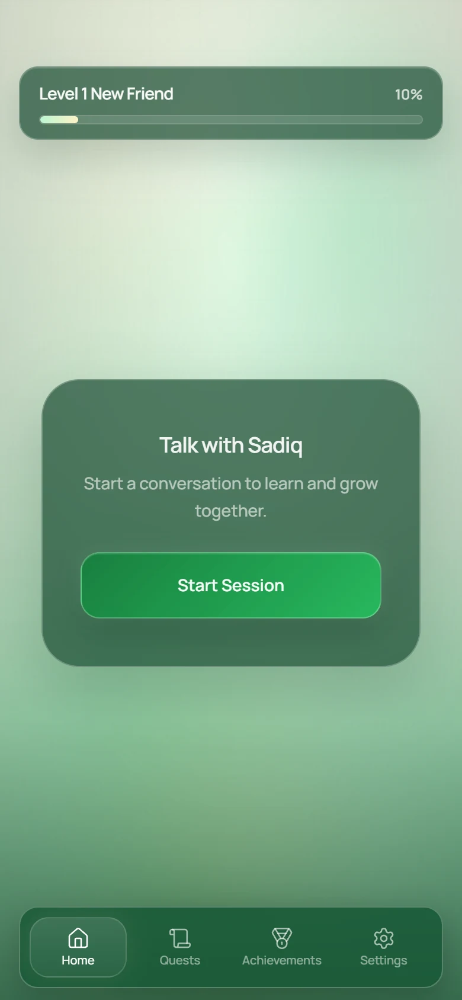</td>
<td>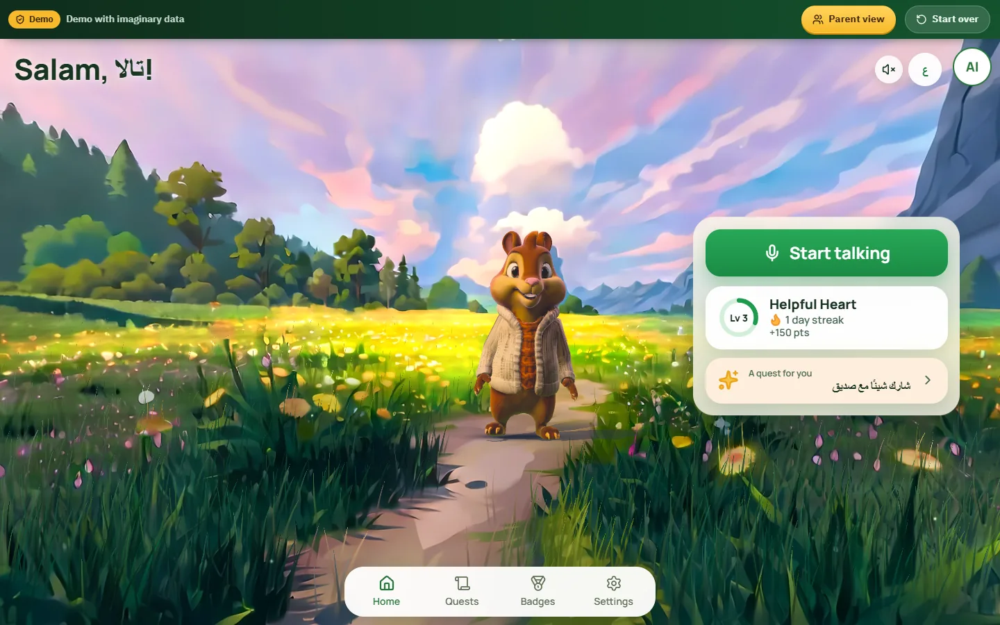</td>
</tr>
<tr>
<td>Old child home (web, in a phone-width window, English only).</td>
<td>New child home: Sadiq stands on the meadow path, the level card and a quest sit beside the Start talking button, the AI chip is at the top. Demo family, synthetic data.</td>
</tr>
<tr>
<td>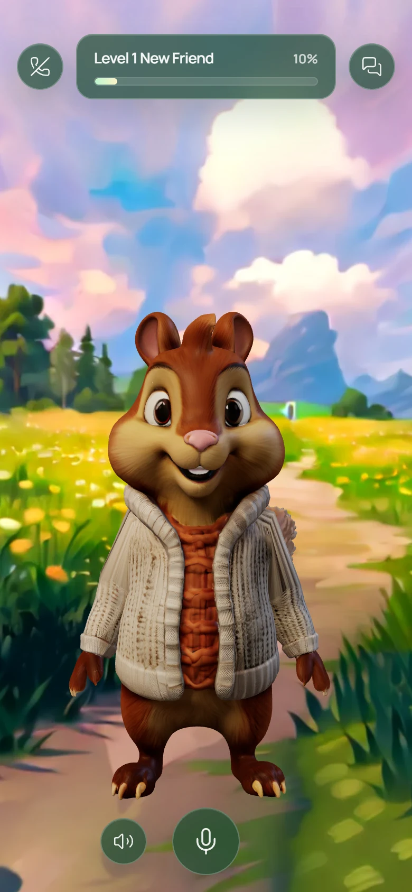</td>
<td>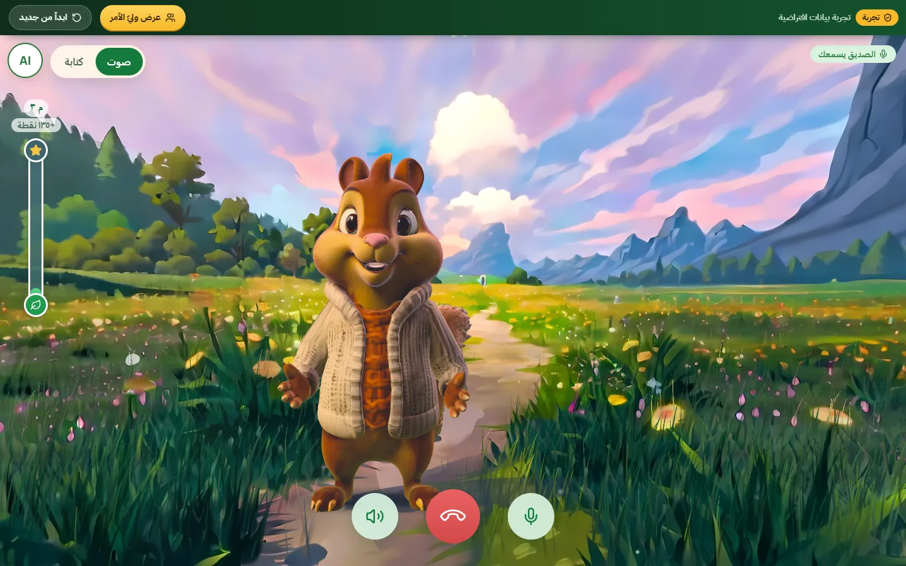</td>
</tr>
<tr>
<td>Old voice call.</td>
<td>New call screen in the Arabic UI (right to left): Voice and Chat switch, "Sadiq is listening" chip, level rail, AI chip.</td>
</tr>
<tr>
<td>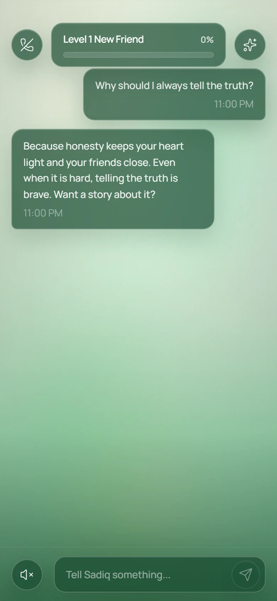</td>
<td>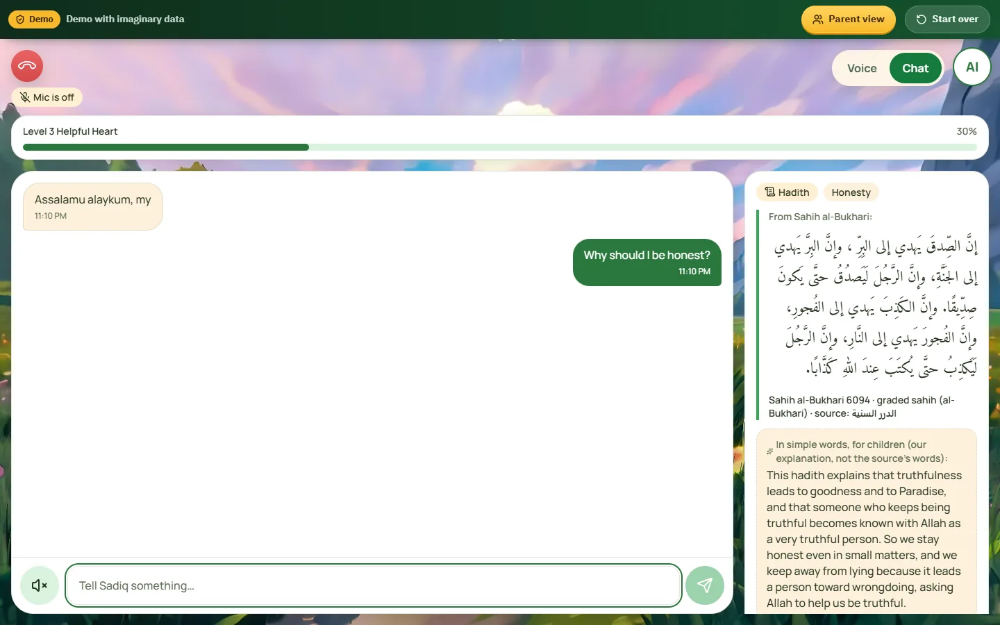</td>
</tr>
<tr>
<td>Old chat mode: plain bubbles, no sources. The two bubbles are synthetic text injected for the screenshot (the old agent was not run).</td>
<td>New chat mode: the child typed "why should I be honest" and a hadith card (Sahih al-Bukhari 6094, graded sahih by al-Bukhari, dorar.net link) appears in the side rail. The card comes from the retrieval layer, not from the model. The capture was taken while Sadiq's greeting was still being written out, so the top bubble is cut short and the model's reply is not shown yet.</td>
</tr>
</table>

More after screenshots: [Arabic home](readme-media/after/home-ar.webp), [phone width](readme-media/after/home-en-phone-520.webp), [English call](readme-media/after/call-voice-en.webp). More before screenshots: [login](readme-media/before/before-login-desktop.webp), [achievements](readme-media/before/before-child-achievements.webp).

#### 2.2 Avatar

<table>
<tr><th>Before</th><th>After</th></tr>
<tr>
<td></td>
<td>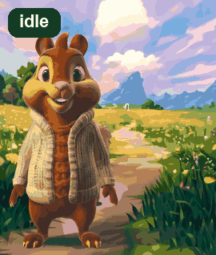</td>
</tr>
<tr>
<td>Old avatar (7.5 s): about 2 s idle, then "speaking". Only the jaw bone moves, on a fixed sine (rate 5.5 rad/s, amplitude 0.18, in the old <code>Avatar.jsx</code>). No blink, no head, eye or body motion, no listening state. The old component ran with a stubbed call transport.</td>
<td>New avatar (7.9 s): idle, listening, then talking with a hand gesture, with blinks. This is the real avatar component on the developer preview page with the state switched by hand, not a live call. In a live call the agent's state picks the loop and the mouth follows the voice.</td>
</tr>
</table>

What changed, with the evidence:
- Model: 42,988,508 bytes (`avatar-round7.glb` at `0241d4d`) to 2,480,896 bytes (`frontend/public/models/avatar/avatar-animated.glb`; facts in `avatar-animated.json`: 93,335 triangles, 32 joints, 30 clips such as Idle, Listen, Think, TalkGesture, Blink, Walk, Wave).
- One animation controller picks the loop from the agent's state, with crossfades; blink is its own layer; the head turns toward the camera (`frontend/src/features/child/components/avatar/`, handoff `docs/hackathon/handoffs/06-avatar-live.md`).
- Lip sync drives 14 viseme shapes from the agent's audio. Text-timed lip sync from ElevenLabs timings and word-timed gestures are on by default (`LIPSYNC_TIMELINE=0` / `GESTURE_EVENTS=0` turn them off).
- On Home, Sadiq walks up the meadow path and idles; at the start of a call the camera eases once into the call framing and stays still (`docs/hackathon/handoffs/product-web.md`, section 5).

#### 2.3 Islamic content

<table>
<tr><th>Before</th><th>After</th></tr>
<tr>
<td width="45%">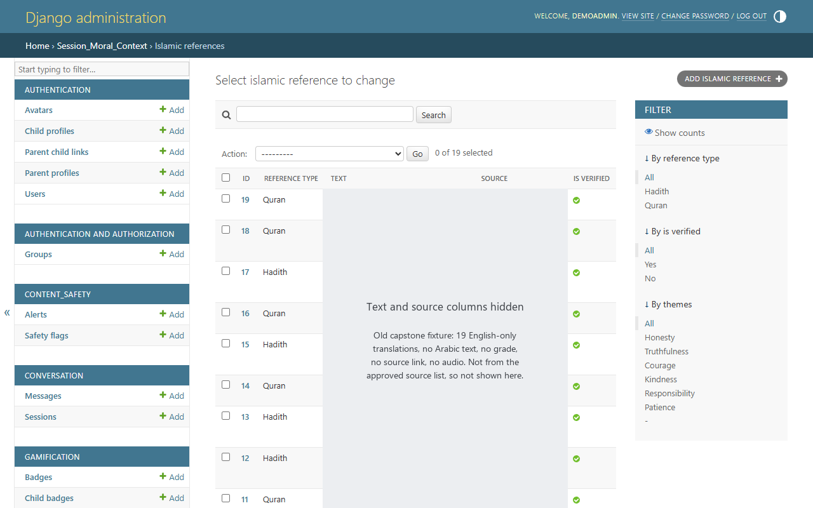</td>
<td>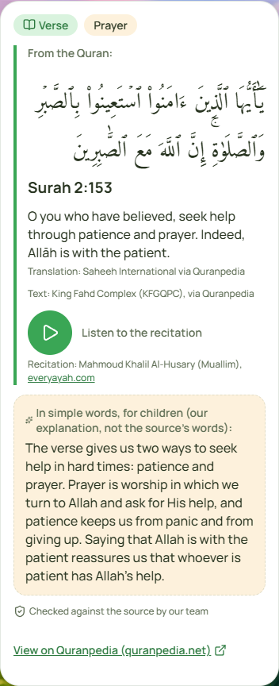 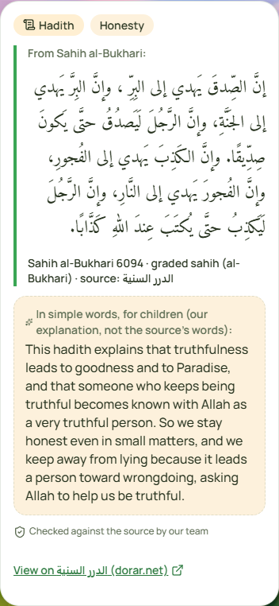</td>
</tr>
<tr>
<td>The old knowledge base as the old admin shows it: 19 references (10 hadith, 9 verses) across 6 themes, English translation text only, a free-text source string, no grade, no link, no audio. We hid the text and source columns: the old admin marks every row verified, but the fixture was never checked against an approved source and it cites collections outside the approved list. It is retired; no agent code reads it now.</td>
<td>Two cards as the child sees them. Verse card: the Uthmani text, the reference, the Saheeh International translation with its credit, the recitation with its credit and an everyayah.com link, our explanation in its own labelled block, and a Quranpedia link. Hadith card: Sahih al-Bukhari 6094, graded sahih by al-Bukhari, our explanation, a dorar.net link.</td>
</tr>
</table>

More cards: [term (Al-Jamhara)](readme-media/after/card-term-en.png), [Arabic verse](readme-media/after/card-verse-ar.png), [Arabic hadith](readme-media/after/card-hadith-ar.png), [Arabic term](readme-media/after/card-term-ar.png), [Bayyinat FAQ, Arabic](readme-media/after/card-faq-ar.png), and the cards in the call screen: [verse](readme-media/after/call-chat-verse-en.webp), [term](readme-media/after/call-chat-term-en.webp), [FAQ](readme-media/after/call-chat-faq-ar.webp). Before: [the old admin's 6 moral themes](readme-media/before/before-islamic-content-admin-themes.png) (names and one-line descriptions only).

**The reviewed bank at `2c04305`** (unchanged since `8c2ff0d`; counted at `735c95a` from `backend/session_moral_context/content/items/*.json` and the review ledger `content/reviewed.json`, and no file under `backend/session_moral_context/` changed between `735c95a` and `2c04305`; `seed_content` at `2c04305` prints "reviewed 273, rejected 0"):

| Type | Items | Source | What each item carries | Reviewed by (ledger) |
|---|---:|---|---|---|
| Verse | 74 (35 surahs) | KFGQPC Uthmani Hafs v2-0 via quranpedia.net; Saheeh International; recitation by Mahmoud Khalil Al-Husary via everyayah.com | Uthmani text, surah and ayah, translation and credit, recitation link and credit | Abdulrahman Salamah |
| Hadith | 94 (Sahih al-Bukhari 60, Sahih Muslim 34) | dorar.net hadith pages; English from HadeethEnc.com for 42 | Arabic text, book, number, grade (sahih), grader (the compiler), dorar.net link | Abdulrahman Salamah |
| Tafsir | 23 | dorar.net tafsir encyclopedia | short excerpt, ayah range, link | Abdulrahman Mahmalji |
| Aqidah | 14 | dorar.net creed encyclopedia | short excerpt, link, a "scholars may differ" note when level C | Abdulrahman Mahmalji (13), Abdulrahman Salamah (1) |
| Fiqh | 8 | dorar.net fiqh encyclopedia | short excerpt, link, "general information, not a ruling" line | Abdulrahman Mahmalji |
| Sirah | 5 | dorar.net history encyclopedia | short excerpt, link | Abdulrahman Mahmalji |
| FAQ | 23 | "Bayyinat: Questions and Answers about Islam", dawa.center | question, short answer, question number and page, link | Abdulrahman Salamah |
| Term | 32 | Al-Jamhara dictionary, islamic-content.com | Arabic and English definition, link | Abdulrahman Salamah |
| **Total** | **273** | | every item has a child explanation in Arabic and English | all 273 reviewed |

- Content levels (the challenge's levels A to D): A 216, B 54, C 3; each level C item carries a disagreement note. Level D questions (personal rulings) are never answered from the bank; they are referred.
- All 38 values have at least one item (311 item-to-value links). Per-value counts: [bank-counts.md](readme-media/after/bank-counts.md).
- "Reviewed" means a named team member checked the item against its cited source, and `mark_reviewed.py` stored a hash of it in the ledger; if the item changes, its review goes stale. It is not a scholar's approval, and the cards say "Checked against the source by our team". A second check of the hadith on dorar.net by another team member is still in progress.
- The organisers' rulings of 5 Oct (HadeethEnc English with dorar Arabic, everyayah recitation with credit, short dorar quotes, 1 to 3 Bayyinat paragraphs, both "Tawhid" and "Monotheism") are in `docs/hackathon/content-approach-plan.md` section 12 and in the [source register](deliverables/sources.md).
- What a child question reaches today: verse, hadith and term cards, and the Bayyinat FAQ through Arabic questions. Tafsir, aqidah, fiqh and sirah items are in the bank but a child-style question did not reach them in our probes (see [limitations](#limits)).

#### 2.4 Voice

| | Before | After |
|---|---|---|
| Text-to-speech | xAI Grok over a custom WebSocket client (`xai_tts_streaming.py`), voice `leo` | ElevenLabs `eleven_flash_v2_5` through `livekit-plugins-elevenlabs==1.5.1` (`backend/requirements.agent.txt`), separate Arabic and English voices, `TTS_PROVIDER=elevenlabs` by default |
| Fallback | none | No automatic fallback. An operator can set `TTS_PROVIDER=xai` by hand (`.env.example`). If ElevenLabs fails, the room gets a `voice_error` and the session ends cleanly |
| Verses | could be spoken by TTS | Verse text inside the Quran brackets never reaches TTS; the card plays the recitation (`backend/conversation/agent/tts_text.py`, `scripture_guard.py`) |
| Cost guard | none | `ELEVEN_DAILY_CHAR_CAP`: after the daily cap, new demo sessions start as text only (`backend/conversation/agent/demo_limits.py`) |
| Speech-to-text and model | OpenAI | unchanged: OpenAI `gpt-4o-mini-transcribe` and `gpt-5.4-mini` (`.env.example`) |

**Running cost: an estimate, not a measured cost** (prices checked on 6 Oct 2026). About **$0.05 to $0.29 per session** in usage fees, from a short session (a greeting and 2 questions, the shape measured in the load rehearsal, taken as 1.5 minutes) to a full 5-minute session of about 10 questions. Five minutes is the demo's session cap (`DEMO_SESSION_MAX_SECONDS=300`); family sessions may run longer, and the family figures assume the same cap. For **30 judges** at 2 to 4 sessions each over the judging window (7 to 22 Oct): about **$3 to $34** in total. For **100 families**, one child each, at 12 to 20 sessions a month: about **$60 to $570 a month**. Every figure is rounded up. Method: measured units (OpenAI calls per session from `docs/hackathon/latency/LOAD-REHEARSAL.md`; tokens from `docs/hackathon/eval-reports/lead-summary.json`, where 6,526 input and 109 output tokens are the mean per eval run (agent plus judge), used as an upper bound for one agent call; ElevenLabs characters: 300 measured for a short session in the load rehearsal, and 2,500 for a full session, which is the rehearsal's own estimate) times the public prices of `gpt-5.4-mini` ($0.75 and $4.50 per million input and output tokens), `gpt-4o-mini-transcribe` (about $0.003 a minute, counted for the whole session because realtime transcription is on by default), ElevenLabs Flash v2.5 ($0.04 per 1,000 characters) and LiveKit Cloud ($0.0005 per participant minute, plus $0.01 per agent-session minute on the high side): [OpenAI](https://platform.openai.com/docs/pricing), [ElevenLabs](https://elevenlabs.io/pricing/api), [LiveKit](https://livekit.com/pricing). The session length, the number of turns, the report tokens, the longer prompt late in a full session and the sessions per judge or family are assumptions; plan fees, the server and prompt-cache discounts are not included. The calculation is `docs/hackathon/deliverables/Presentation/deck-src/cost_estimate.py`, and the method is on the deck's appendix slides 24 and 25.

<a id="parent"></a>

#### 2.5 Parent view

<table>
<tr><th>Before</th><th>After</th></tr>
<tr>
<td>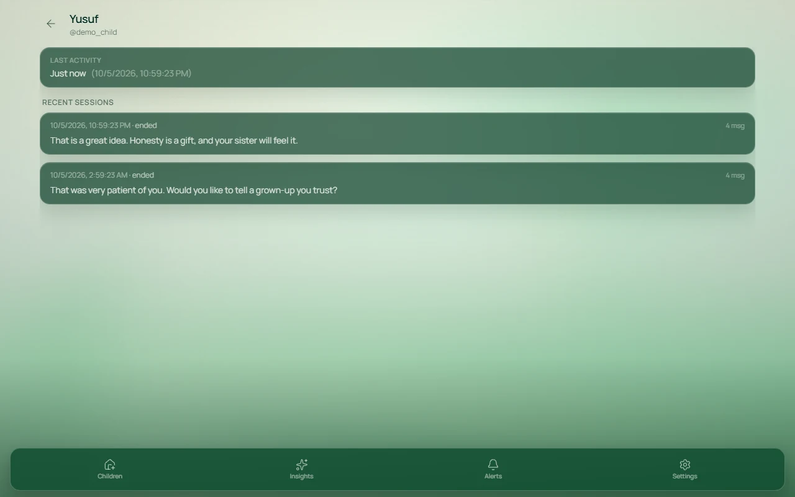</td>
<td>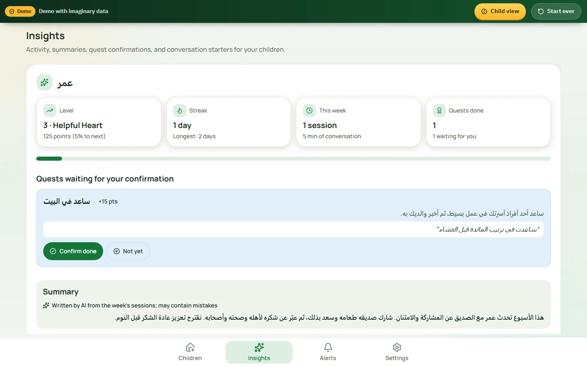</td>
</tr>
<tr>
<td>Old parent view of a child: each session listed with a preview of its last message (synthetic text here).</td>
<td>New parent Insights (English UI, synthetic Arabic family): level, streak, this week's sessions, a quest waiting for the parent's confirmation, and the weekly summary under the label "Written by AI from the week's sessions; may contain mistakes". The parent API's <code>preview</code> field is now always empty (test: <code>backend/reporting/test_privacy_prompts.py</code>).</td>
</tr>
<tr>
<td>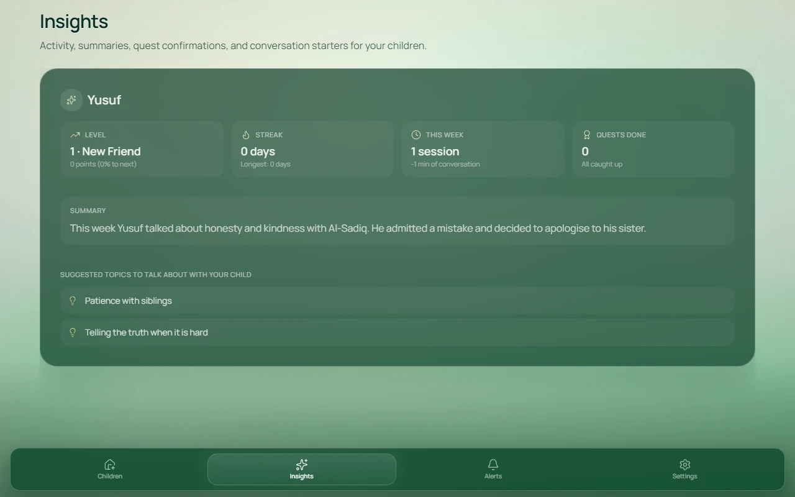</td>
<td>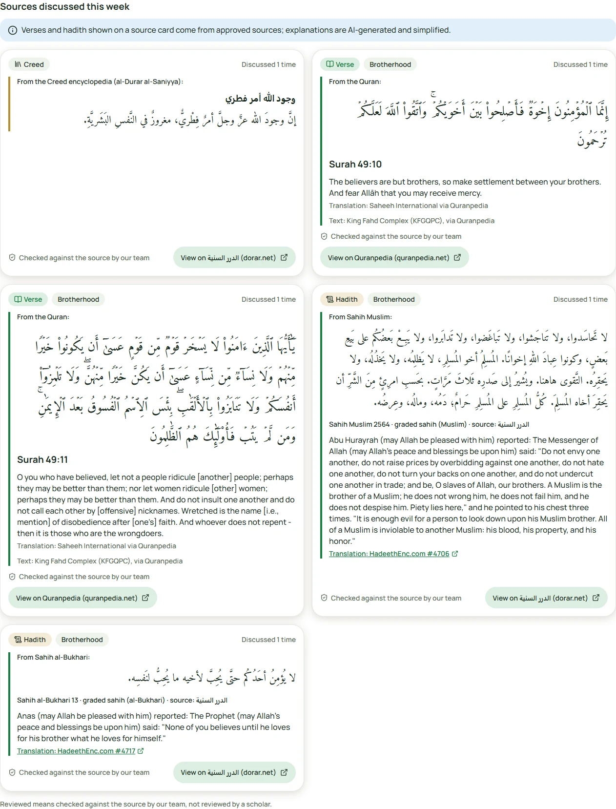</td>
</tr>
<tr>
<td>Old Insights: a summary with no AI label and suggested topics. Nothing showed which verses or hadith the child had seen.</td>
<td>New "Sources discussed this week" (merged in PR #59; captured again on 6 Oct at <code>2c04305</code>, after PR #64): a trust line, then one card per source the child was shown this week. This capture shows the five sources a demo family is seeded with (PR #58): two verses, two hadith and one creed excerpt from the al-Durar encyclopedia. The <a href="readme-media/after/parent-sources-ar.webp">Arabic capture</a> is of a different demo family: each family's sources are rotated by its slot, so all five differ, with a tafsir excerpt in place of the creed one. Each card carries its type, its value when the item is linked to one (the creed excerpt here is not), "Discussed 1 time", the item's title when it has one (shown since PR #64, never on a verse card), the Arabic text, the reference (surah and ayah; the hadith's book, number and grade; or the encyclopedia's name), the English translation where the item has one (the encyclopedia excerpt has none), "Checked against the source by our team" and the source link. The footer reads "Reviewed means checked against the source by our team, not reviewed by a scholar." Demo family, synthetic data.</td>
</tr>
</table>

How the sources get there: each card served in a call is stored as a `ServedReference`. After the call, `post_session_pipeline` copies them into `SessionReport.sources_used` from the database, never from the model (`build_sources_snapshot` in `backend/reporting/services.py`). The insights API returns this week's sources, merged by item, as `sources` (`weekly_sources`; `backend/reporting/views.py`; test `backend/reporting/test_sources.py`). The page is `SourcesDiscussed` in `frontend/src/features/parent/components/InsightsTrust.jsx`, drawn by `ParentSourceCard.jsx` and rendered in `frontend/src/pages/parent/InsightsPage.jsx`. Each source goes through the child card's `normalizeReference` first, so the same link and grade checks apply (commit `7d2a3b3`). "Values this week" and "Questions to discuss" follow it when they have data. Every demo family is seeded with sources dated this week: 2 hadith that have English text, 2 verses and 1 item of another type, rotated by family (PR #58, `_seed_sources` in `backend/demo/services.py`, tests in `backend/demo/tests.py`).

The parent never sees the child's own words. Since PR #62, a sentence in a session report or a weekly summary that repeats 6 consecutive words of a child message (or all of a 4- or 5-word message) is removed before it is stored, with Arabic spelling variants folded, and suggested topics that do so are dropped (`strip_child_echo` in `backend/reporting/services.py`; tests in `backend/reporting/test_privacy_prompts.py`). It matches words, so a paraphrase still gets through ([section 7](#limits)).

Also: [Sources (AR)](readme-media/after/parent-sources-ar.webp), [Alerts (EN)](readme-media/after/parent-alerts-en.webp), [Insights (AR)](readme-media/after/parent-insights-ar.webp), [Alerts (AR)](readme-media/after/parent-alerts-ar.webp); before: [Alerts](readme-media/before/before-parent-alerts.webp), [Children](readme-media/before/before-parent-children.webp).

#### 2.6 Safety and grounding

What runs on every turn, voice and typed alike (`backend/conversation/agent/turn_policy.py`, `turn_pipeline.py`, rules in `backend/session_moral_context/content/turn_rules.json`):

1. **Safety first.** Harm, abuse, grooming (secrecy, gifts, isolation, online contacts) and personal-information requests go to a safety reply and a safety flag. When the person described may be at home, the case is recorded for staff and no parent alert is sent. Tests: `conversation/test_distress_gate.py`, `conversation/agent/test_safety_classes.py`.
2. **Comfort.** A sad, scared or lonely child gets comfort and a trusted adult, never a verse or a lesson ("distress veto"). When such a turn describes harm but matches no safety rule, the comfort instructions ask the model to raise the safety flag, so there the flag depends on the model ([known limitations](deliverables/known-limitations.md)).
3. **No source, no answer.** A religious question with nothing in the bank is declined with "I don't have a trusted source for that" and a suggestion to ask a parent or teacher. Requests to invent a hadith or recite from memory are declined. The output guard removes unsourced attributions and keeps verse text out of speech (`scripture_guard.py`).
4. **Levels.** Personal rulings (level D) are referred to a parent or scholar; disputed matters (level C) show that scholars differ and refer.
5. **Card gate** (merged in PR #56, `8c2ff0d`). A card appears only when the child asks about an Islamic topic or a value. A value word in plain chat ("I was honest with my teacher today") gets a warm reply in Sadiq's own words with no card. Greetings and thanks ("thank you", «شكرا», salam) are answered in kind and never pull a card. `TURN_CARD_GATE=0` restores the old behaviour. Tests: `conversation/test_card_gate.py`.
6. **Excerpts stay on the card.** Tafsir, aqidah, fiqh, sirah and FAQ excerpts are never given to the model; it gets the citation and our labelled explanation (`retrieval.py`, `_CARD_ONLY_TYPES`).
7. **Hope first.** Teaching about Jannah, the Fire and accountability puts hope first and is never graphic (الترغيب قبل الترهيب), a lead decision after consulting a scholar on 5 Oct. The persona block is `_HOPE_AND_ACCOUNTABILITY` in `agent_class.py` (commit `459cdd7`); the matching content filters and the record of the scholar consultation are in commit `c01f25a`.
8. **AI disclosure.** Sadiq says he is an AI, not a person; "who made you" gets a fixed answer with no vendor names. A permanent AI chip opens an info sheet in both languages with a link to the privacy page.

**Security audit** (PR #62): every endpoint that takes an id was checked for access by another family. The merged fixes include: a parent sees a child's alerts only while their link to that child is approved, the child's LiveKit room token lasts 10 minutes by default instead of 6 hours (the demo uses its session limit plus 2 minutes), production refuses to start with the public development LiveKit secret, and the child-echo filter in [section 2.5](#parent). The items it leaves for the lead are listed in that file.

**Security round 2** (PR #65): the child-echo filter now also runs when a session report is written, on the fields a parent sees and on the text the weekly summary is built from, and a quest whose title repeats the child's words is dropped (`backend/reporting/test_echo_write_time.py`); a second endpoint sweep fixed a quest reward paid twice on parallel completions, a password reset broken by an account whose email differs only in letter case, and a stored script in the superadmin dashboard, whose API is now read-only (`backend/authentication/test_authz_sweep2.py`, `backend/superadmin/test_security_audit.py`); request limits now count in one cache shared by all workers, Redis when it is set up, with a per-process fallback if it fails, plus new limits on password reset, token refresh and session starts (`backend/config/test_throttling.py`); and Caddy sends security headers and a Content-Security-Policy in report-only mode, not enforced yet (`infra/caddy/Caddyfile`, `frontend/tests/security.test.mjs`). **PR #66**: when another caller has already completed a quest, Sadiq's own completion call returns a message instead of an error (`backend/conversation/agent/test_quest_race.py`), and `AUTH_RATE` sets the login limit.

<table>
<tr><th>AI chip sheet</th><th>Privacy page</th></tr>
<tr>
<td>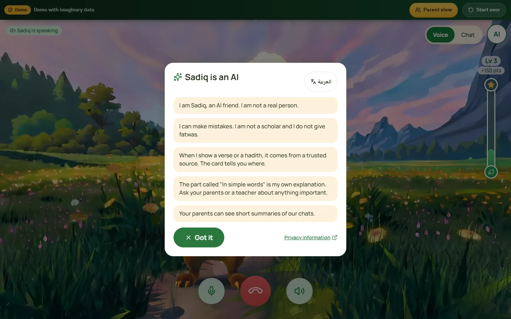</td>
<td>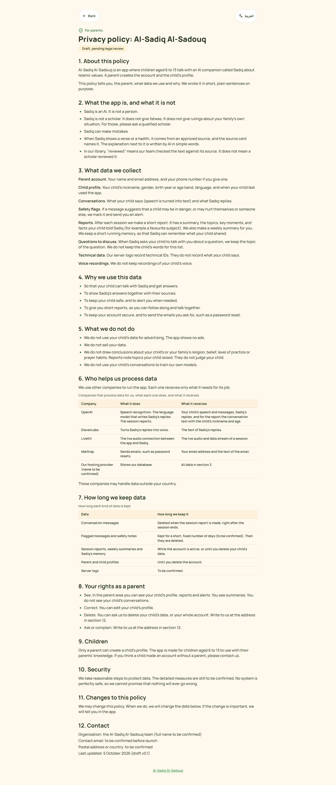</td>
</tr>
<tr>
<td>The AI sheet: five lines (an AI friend, not a person; can make mistakes, not a scholar, no fatwas; verses and hadith come from a trusted source; "In simple words" is Sadiq's own explanation; parents see short summaries). Arabic: <a href="readme-media/after/ai-chip-sheet-ar.webp">screenshot</a>.</td>
<td>The public <code>/privacy</code> page in Arabic and English. It still shows the badge "Draft, pending legal review". Arabic: <a href="readme-media/after/privacy-ar.webp">screenshot</a>.</td>
</tr>
</table>

<a id="results"></a>

### 3. Measured results

Every number below has its source and its conditions. Numbers we did not measure are not given. The capstone (`0241d4d`) had no eval harness, so there is no capstone baseline; "before" means the earlier hackathon build named in each row.

| What | Before | After | How it was measured | Source |
|---|---|---|---|---|
| Policy eval: every case on both channels, no model calls | 338 pass, 24 fail, 30 content gap (392 runs) at `97f26aa`, before PR #56 | **340 pass, 22 fail, 30 content gap** at `2c04305`, the same output as at `8c2ff0d` (PR #56), `08075e1` and `735c95a` | `python manage.py run_eval --settings=config.settings_sqlite_test --no-fail`; we ran `97f26aa` and `8c2ff0d` on 5 Oct, `08075e1`, `735c95a` and `2c04305` on 6 Oct | output of the command ([section 6](#tests)) |
| Safety category in that eval | 92 of 92 pass | 92 of 92 pass | same run | same |
| Live model eval, held-out cases (never used for tuning), strict pass | 10 of 40 = 25% | **18 of 41 = 44%**; paired change +20.5 points (95% bootstrap +5.1 to +35.9), exact McNemar p = 0.039 | before = knowledge-bank branch `4fccb39`, after = product build `dba765e`; `gpt-5.4-mini` agent, model judge, text only, one run each | [eval-reports/README.md](eval-reports/README.md) |
| Same eval, safety category, strict | 12% | 72% | 25 runs, both splits | same |
| Policy dry run, 186 cases, gaps excluded | 137 of 158 = 87% | 153 of 158 = 97% | no model calls | same |
| Lesson-creep proxy, before and after the card gate | 51.5% on the lead's probe set; 45.5% on the lead's holdout | **0%** on both; courtesy turns with a card 0 of 55; questions that must still get a card 40 of 40 | the lead's own probe sets (not in this repository), before and after PR #56, 5 Oct. A proxy, not a judged rate, and not reproduced by us; one held-out small-talk case (`heldout-02-ar`) still serves verses in our policy run | the lead's PR #56 description, copied with its wording into [quality-gate-summary.md](eval-reports/quality-gate-summary.md) |
| Conversation quality gate: the lead's sealed sets (610 turns and 20 conversations), judged by Opus with the lead's rubric, 11 rows with targets | all 11 rows fail at `d794bc7` (5 Oct): 37 hallucinations; lesson creep 19.8% on casual turns and 59.1% on greetings, thanks and goodbyes; grounded 46.7%; declined with nothing from memory 89.3%; referred 66.7%; neither confirmed nor denied 83.3%; comfort or safety path 63.6%; identity 93.3%; friend quality 3.61 per turn and 2.35 per conversation | **2 of 11 rows pass** at `8cbe64a` (6 Oct): lesson creep **9.9%** (target 10% or less, passed by 0.1 point) and identity **100%**. Still failing: **34 hallucinations** (target 0; 33 judged, 1 a harness false alarm); greetings 4.5%; grounded 68.9%; declined 78.6% (worse); referred 83.3%; neither confirmed nor denied 83.3%; comfort or safety path 63.6%; friend quality 3.96 per turn and 3.20 per conversation (target 4) | before = build `d794bc7`, before the card gate (PR #56), 74 verses servable; after = `hackathon` at `8cbe64a` (the same product code as `2c04305`), with the card gate and the 273 reviewed items. Both: `gpt-5.4-mini` agent and child simulator, voice channel, one run each, a code finding overrides the judge. Persona turns after the opening are written by the simulator, so they differ between the runs | [quality-gate-summary.md](eval-reports/quality-gate-summary.md) sections 1 and 3: the numbers only, because the full report names and quotes the sealed test lines |
| Time to first audio | not measured | about 2.6 s from the end of the child's speech to the reply, about 3.0 s for the greeting, flat at 1, 5 and 10 simultaneous sessions | local Docker stack, real OpenAI and ElevenLabs, headless browsers | [latency/LOAD-REHEARSAL.md](latency/LOAD-REHEARSAL.md) |
| Backend tests | | **1686 passed, 2 skipped** (1688 run) at `2c04305` | `python manage.py test --settings=config.settings_sqlite_test`, serial like `--parallel 1`, run by us on 6 Oct in the project's agent Docker image | output of the command |
| Frontend checks | | lint clean, build OK, `check:cards` passed, `test:i18n` 13 of 13, security test 6 of 6, at `2c04305` | `npm ci`, the npm scripts and `node --test tests/security.test.mjs` (PR #65), run by us on 6 Oct | output of the commands |

The quality gate's first run is the reason the card gate exists: 25 of its 37 hallucinations came from a card served on a keyword hit that the model then talked past, and every greeting or thanks that got a lesson was a card on a keyword. The re-run shows the card gate did that job: cards on casual turns fell from 27 to 2 of 162, lesson creep from 19.8% to 9.9%, and friend quality on turns with a card rose from 2.53 to 3.23 (from 4.00 to 4.15 on turns without one). It did not fix hallucinations: of the 34, 21 are the model's own claims beside a served card or credited to it (17 of them on real religious questions), 11 come from memory with nothing served, 1 is a "scholars differ" and 1 a harness false alarm. Declined fell from 89.3% to 78.6%, and false alarms on casual and light-value lines rose from 2 to 4 of 224. The judged 9.9% and the lead's 0% proxy in the row above are different measures: the proxy counts the turn policy's card decisions, with no model, on the lead's own sets, while the judge also counts a conduct tag with no card (14 of the 16 creeping turns). Caveats for the live eval (from its report): one run per side, team-written cases scored by a model judge, text channel only, and "before" is the knowledge-bank branch, not the capstone agent.

<a id="try"></a>

### 4. Try it: the judge demo

1. Open https://alsadiqai.com once the hackathon build is deployed (see the status above), or run it yourself ([section 5](#run)).
2. Press **Try Al-Sadiq** (جرب الصديق). You get a synthetic family for 45 minutes. No sign-up, no password.
3. Press **Start talking**. Switch to **Chat** if you prefer typing.
4. Follow [docs/hackathon/DEMO.md](DEMO.md): each child line in it was checked against the rules layer at `2c04305` (which card appears, or which referral). Type the lines exactly; speech-to-text can change the wording.
5. Press **Parent view** (عرض ولي الأمر) to see the same family as a parent; **Insights** shows "Sources discussed this week". Press **Start over** to reset.

<a id="run"></a>

### 5. Run it yourself

You need Docker with Compose. The voice and chat replies need your own OpenAI and ElevenLabs keys; the UI, the demo login, the parent view, the eval and the tests run without them.

```bash
git clone <repository-url> Alsadiq-Alsadouq
cd Alsadiq-Alsadouq
cp .env.example .env
# In .env set: OPENAI_API_KEY, ELEVEN_API_KEY, ELEVEN_VOICE_ID_AR, ELEVEN_VOICE_ID_EN,
#              DEMO_MODE=1 and VITE_DEMO_MODE=1 (the one-tap demo).
# The LiveKit development keys in .env.example match infra/livekit/livekit.yaml.
docker compose --profile all up --build
```

Then open http://localhost:5173 and press **Try Al-Sadiq**. The backend container runs `migrate`, `migrate --check`, `seed_admin` and `seed_content` on start (`docker-compose.yml`), so the 273 items are loaded. The first demo start seeds the 40 synthetic families; you can also run `docker compose exec backend python manage.py seed_demo --ensure`.

| Service | URL |
|---|---|
| Web app | http://localhost:5173 |
| Backend API and Django admin | http://localhost:8000, http://localhost:8000/admin |
| LiveKit (development server) | ws://localhost:7880 |

The development stack publishes Postgres and Redis on 127.0.0.1 only (`docker-compose.yml`, PR #62). It runs with `DEBUG=1`; the settings treat an unset `DEBUG` as production.

Production runs `docker-compose.prod.yml` behind Caddy with LiveKit Cloud, with `DEBUG` off unless the server's `.env` sets it. With `DEBUG` off the backend refuses to start if `DJANGO_SECRET_KEY` is unset or empty, or if `LIVEKIT_API_SECRET` is empty or still the development LiveKit secret from `.env.example` (`backend/config/settings.py`). It does not check the Django key's value, so the `change-me-to-a-random-secret-key` placeholder in `.env.example` is accepted and must be replaced by hand. The deploy workflow (`.github/workflows/deploy.yml`, PRs #60 and #61) builds the images, with static files collected at image build; validates the Caddyfile; runs `migrate` and `migrate --check` in one-off containers before `up -d`; recreates Caddy so a changed Caddyfile is loaded; runs `seed_content`, and `seed_demo --ensure` when `DEMO_MODE` is on; and fails the run unless `/api/health/` (database and Redis) answers 200 through Caddy. The deploy steps are in [docs/hackathon/DEPLOY-CHECKLIST.md](DEPLOY-CHECKLIST.md) and the demo settings in [docs/hackathon/DEMO-LOGIN.md](DEMO-LOGIN.md). Never commit `.env`.

<a id="tests"></a>

### 6. Tests

Backend, no Postgres needed. The suite imports `livekit.agents`, so install the agent requirements (they include `requirements.txt`):

```bash
cd backend
pip install -r requirements.agent.txt
python manage.py test --parallel 1 --settings=config.settings_sqlite_test
# 6 Oct, 2c04305: Ran 1688 tests, OK (skipped=2)   -> 1686 passed, 2 skipped

python manage.py run_eval --settings=config.settings_sqlite_test --no-fail
# 6 Oct, 2c04305: runs 392: pass 340, fail 22, content-gap 30
```

The live model eval (`run_eval --llm`) needs an OpenAI key and has a call cap; how to run it is in [docs/hackathon/eval-reports/README.md](eval-reports/README.md).

Frontend:

```bash
cd frontend
npm ci
npm run lint
npm run build
npm run check:cards     # source-card rules: hosts, grades, labels, verse markers
npm run test:i18n       # Arabic and English strings, digits, dates
node --test tests/security.test.mjs   # no raw HTML or eval sinks; Caddy security headers (PR #65)
# 6 Oct, 2c04305: lint clean, build OK (chunk-size warning only),
# check:cards passed, test:i18n 13 of 13, security test 6 of 6
```

<a id="limits"></a>

### 7. Known limitations

The full list, with links to the code: [docs/hackathon/deliverables/known-limitations.md](deliverables/known-limitations.md). The main ones:

- **Not a scholar.** "Reviewed" means a team member checked the item against its source; no scholar reviewed the bank. The second hadith check on dorar.net is still in progress.
- **Rules, not understanding.** The rules layer works on words. New phrasings can miss: 22 policy-eval runs fail, among them the organisers' sample questions. The Arabic Kaaba question gets three verses from unrelated values, caring for orphans and keeping promises (93:9, 2:220, 17:34; case `tq01-kaaba-ar`). The English one gets the Salah term and two prayer verses (20:14, 2:153; `tq01-kaaba-en`). "Who wrote the Quran" gets the Quran term, plus 20:114 and 39:9 in Arabic, instead of the Bayyinat answer (`tq02-quran-author-ar`, `tq02-quran-author-en`). The test-question category is 28 pass, 8 fail, 16 content gap.
- **Not every item type is reachable.** Up to 3 items are served per turn (`MAX_ITEMS = 3`), chosen by keyword-match score, with the item type only as a tie-break (`match_values` in `backend/conversation/agent/retrieval.py`). In our probes of child-style questions, tafsir, aqidah, fiqh and sirah cards never reached the top 3. The Bayyinat FAQ was reached through Arabic questions only.
- **The model can still be wrong in its own words.** Explanations around a card are generated; the guards remove scripture and unsourced attributions, not every possible mistake. The judged quality-gate re-run of 6 Oct (the lead's sealed sets, 610 turns) still counts 34 hallucinations (33 judged, 1 a harness false alarm; 37 before the card gate), and 4 of 224 casual or light-value lines took a safety path they did not need ([section 3](#results)).
- **Live paths not fully re-tested.** Interrupted voice replies and every live path have not been checked end to end. Repeat-run spread of the live eval is not measured.
- **Privacy page is a draft** pending legal review. Some statements on it still need the team's confirmation.
- **Dependencies.** OpenAI (speech-to-text and the model) and ElevenLabs (voice) have no automatic fallback; if OpenAI is out of credit, replies fail.
- **Recitation audio.** The verse card's player streams the recitation from everyayah.com (`audio_url`), so the card's player needs that site to be up. Copies of the 74 clips served from `/static/quran/` are used only for verse markers inside text ([section 8](#third-party)).
- **Parent sources need a finished call.** A new call's cards reach "Sources discussed this week" only after the call ends and its report is written (`post_session_pipeline`); the demo families start with seeded sources ([section 2.5](#parent)).
- **The child-echo filter matches words.** It removes summary sentences that copy a run of the child's words; a paraphrase of what the child said still reaches the parent. The weekly summary only sees flagged messages, because other messages are deleted after each report (security audit, PR #62, H1).

<a id="third-party"></a>

### 8. Third-party sources, services and assets

The organisers' main instruction was to document every source. Our licence does not cover anything in this section; each item stays under its owner's terms.

**Islamic content (the 273-item bank)**

| Source | Used for | Terms and permission |
|---|---|---|
| King Fahd Glorious Quran Printing Complex (KFGQPC), Uthmani Hafs text v2-0 | Arabic text of the 74 verses | https://qurancomplex.gov.sa/ ; read through Quranpedia, accepted by the organisers (5 Oct) |
| Quranpedia | Where the verse text is read (mushaf 2) and the link on every verse card | https://quranpedia.net/ |
| Saheeh International translation, via Quranpedia | English line under each verse, credited on the card | via https://quranpedia.net/ |
| everyayah.com, recitation by Mahmoud Khalil Al-Husary | Recitation on every verse card, credited with a link. The card's player plays the clip from everyayah.com (`audio_url`). The same 74 clips (mp3, 41.9 MB) are also stored in this repository at `backend/session_moral_context/static/quran/` (since commit `73a4db9`, 4 Oct) and served at `/static/quran/` by the backend image only; they are the fallback for verse markers inside text | https://everyayah.com/ ; accepted by the organisers with the source name and link shown (5 Oct). The lead decided on 6 Oct to keep the 74 files in the repository, with this attribution to everyayah.com |
| Al-Durar Al-Saniyya (dorar.net): hadith pages and the tafsir, creed, fiqh and history encyclopedias | 94 hadith (Arabic, grade, grader), 23 tafsir, 14 aqidah, 8 fiqh and 5 sirah excerpts | https://dorar.net/ ; short quotes with a link and our labelled simplification for children allowed by the organisers (5 Oct) |
| HadeethEnc.com | Finding hadith by topic; English text for 42 hadith, with its own link | https://hadeethenc.com/ ; accepted for English beside dorar Arabic (5 Oct) |
| "Bayyinat: Questions and Answers about Islam" (dawa.center) | 23 FAQ items, 1 to 3 paragraphs each, with question number and page | https://dawa.center/file/7937 ; allowed by the organisers (5 Oct) |
| Al-Jamhara Islamic dictionary (islamic-content.com) | 32 terms, Arabic and English definitions | https://islamic-content.com/dictionary |

**Run-time services**

| Service | Used for | Terms |
|---|---|---|
| OpenAI API | Speech-to-text (`gpt-4o-mini-transcribe`), the conversation model and the post-session reports (`gpt-5.4-mini`) | https://openai.com/policies/ |
| ElevenLabs | Text-to-speech (`eleven_flash_v2_5`); also the seven short "hmm" filler sounds, rendered once with ElevenLabs and stored in `backend/conversation/agent/assets/fillers/` (`render_fillers.py`, its `README.md`) | https://elevenlabs.io/terms-of-use |
| LiveKit (Agents 1.5.1, server, client SDKs; LiveKit Cloud in production) | Real-time voice rooms | SDKs Apache-2.0: https://github.com/livekit/agents/blob/main/LICENSE ; Cloud: https://livekit.io/legal/terms-of-service |
| xAI Grok TTS | Manual operator rollback only, off by default | https://x.ai/legal/terms-of-service |
| Silero VAD | Voice activity detection in the agent | MIT: https://github.com/snakers4/silero-vad/blob/master/LICENSE |
| Mailtrap (SMTP), from the capstone | Password-reset emails for parent accounts (`backend/authentication/views.py`). `.env.example` sets the SMTP backend with Mailtrap's host; when `EMAIL_BACKEND` is not set, Django prints emails to the console (`backend/config/settings.py`). The one-tap demo sends no email | https://mailtrap.io/terms/ |
| DigitalOcean, Caddy | Hosting and TLS for the live demo | provider terms; Caddy is Apache-2.0 |

**Assets and libraries**

| Item | Where | Terms |
|---|---|---|
| 3D avatar base mesh, generated with Tripo (before the window), then rigged and animated by the team | `frontend/public/models/avatar/` | Tripo terms: https://www.tripo3d.ai/terms ; the plan and terms for public use are being confirmed (open item) |
| Painted meadow `fantasy-meadow.webp` (added June 2026, before the window): generated by the team lead with World Labs (a view of a world made in Marble; `docs/hackathon/handoffs/meadow-hq.md`) | `frontend/public/backgrounds/` | World Labs terms: https://www.worldlabs.ai/terms-of-service . Who owns an output depends on the plan of the account that made it: a paid account owns it; on a free account World Labs keeps the rights and allows non-commercial use only. Which plan the lead's account is on is to be confirmed with the lead (open item) |
| Sizes of that meadow made in the window: `hq/meadow-*.webp`, upscaled with Real-ESRGAN (commit `f9c4eb6`); `hq/meadow-narrow-*.webp`, the same picture for narrow screens (`94332b8`); `fantasy-meadow-900.webp` and `-1600.webp`, smaller copies | `frontend/public/backgrounds/`, `frontend/public/backgrounds/hq/` | the source picture's terms above. Tools: Real-ESRGAN ncnn-vulkan, MIT (https://github.com/xinntao/Real-ESRGAN-ncnn-vulkan), with the `realesrgan-x4plus-anime` model from Real-ESRGAN, BSD-3-Clause (https://github.com/xinntao/Real-ESRGAN); not a project dependency |
| `meadow-env-1024.webp` (added in the window, `b62c47f`): a 1024 px meadow panorama used as image-based light on the avatar (`docs/hackathon/handoffs/06-lookdev.md`) | `frontend/public/backgrounds/` | the handoff does not record where the panorama came from; to be confirmed (open item) |
| Older painted background `background.png` and `background.webp` (April 2026), badge and quest images (before the window) | `frontend/public/backgrounds`, `badges`, `child-quests` | AI-generated; the tool and its terms are being confirmed (open item) |
| Fonts: Manrope, Amiri, Amiri Quran, Baloo Bhaijaan 2, IBM Plex Sans Arabic, loaded from Google Fonts | `frontend/index.html` | SIL Open Font License 1.1: https://openfontlicense.org/ ; e.g. https://fonts.google.com/specimen/Amiri |
| KFGQPC Hafs font | not bundled; the verse card falls back to Amiri Quran (`frontend/public/fonts/README.txt`) | if added, unmodified, per https://fonts.qurancomplex.gov.sa/ |
| GSAP 3 (`gsap`, `@gsap/react`) | web animation | GSAP Standard "no charge" licence: https://gsap.com/standard-license |
| React, Vite, three.js, React Three Fiber, drei, Tailwind CSS, lucide-react, axios, livekit-client | web app | MIT, ISC or Apache-2.0, per each package |
| Django, Django REST framework, SimpleJWT, psycopg2, gunicorn, whitenoise, Celery | backend | BSD, MIT or LGPL, per each package |

A licence-scanner pass over the libraries is still an open item ([CHECKLIST.md](submission/CHECKLIST.md)). The same table is kept in `docs/hackathon/CURRENT_STATE.md` section 9.

<a id="ai-tools"></a>

### 9. AI tools used to build it

Full log: [docs/hackathon/deliverables/ai-tools-log.md](deliverables/ai-tools-log.md).

- **Claude Code** (Anthropic): an Opus 5.5 main session planned, delegated and reviewed; Sonnet 5.5 and Haiku sub-agents wrote code, searched and took notes; an Opus reviewer checked every non-trivial change before merge. Agent roles are in `.claude/agents/`.
- **OpenAI Codex** with `codex-plugin-cc`: the queued tasks X1, X3, X4, X7 and X8 (internal brief, not published).
- **Skills and plugins:** LiveKit agent skills, Expo skills and React Three Fiber skills (`skills-lock.json`, `.claude/skills/`), `ui-ux-pro-max` and `ponytail` (`.claude/settings.json`), and the `graphify` code graph (`CLAUDE.md`).
- **At run time:** OpenAI `gpt-4o-mini-transcribe` (speech-to-text) and `gpt-5.4-mini` (conversation and reports), ElevenLabs `eleven_flash_v2_5` (voice). The live eval used a separate model as judge.
- **Images:** in the window, Real-ESRGAN upscaled the painted meadow (`docs/hackathon/handoffs/meadow-hq.md`). Before the window, Tripo made the avatar's base mesh, and the team lead generated the meadow with World Labs (Marble) ([section 8](#third-party)).
- Rules for every agent (`AGENTS.md`): never write Quran or hadith text from memory, use only the approved sources, and copy source text by script with a hash check.

<a id="deliverables"></a>

### 10. Challenge deliverables

| Requirement (participant guide) | Where | Status |
|---|---|---|
| Working product with a live link through 22 Oct | https://alsadiqai.com | hackathon build not yet deployed (code freeze 6 Oct 13:00) |
| Public GitHub repository, no keys or user data | this repository, published as a fresh public repo | open (team) |
| Documentation: idea, setup, operation, dependencies, register of sources, tools and licences | this README, [sources.md](deliverables/sources.md), [ai-tools-log.md](deliverables/ai-tools-log.md), [DEMO.md](DEMO.md) | in this branch |
| Presentation (PDF or PowerPoint) | [Al-Sadiq-Al-Sadouq-Final.pptx](deliverables/Presentation/Al-Sadiq-Al-Sadouq-Final.pptx) on the organisers' template, with a [PDF preview](deliverables/Presentation/Al-Sadiq-Al-Sadouq-Final-preview.pdf) | draft: marked slots still open for the video and repository links; slide 22 carries the judged quality-gate re-run of 6 Oct; the cost per session and per month is filled in as a labelled estimate |
| Video of at most 2 minutes | team video | open (team) |
| Disclosure of pre-existing work | [DISCLOSURE.md](submission/DISCLOSURE.md) | draft, to finish at freeze |
| Synthetic data only | `backend/demo/content.py` (40 synthetic families) | done |

The full mapping, with owners and proof, is [docs/hackathon/submission/CHECKLIST.md](submission/CHECKLIST.md).

<a id="architecture"></a>

### 11. Architecture and repository map

```
Child (web, voice or chat) ──WebRTC──> LiveKit ──> voice agent (backend/conversation/agent)
                                                    │  speech-to-text (OpenAI)
                                                    │  turn policy: safety > comfort > refer > card gate > bank
                                                    │  retrieval from the reviewed bank (ContentItem.servable())
                                                    │  model (gpt-5.4-mini) with the sources block
                                                    │  output guard, then text-to-speech (ElevenLabs)
                                                    └─ "reference" event ──> source card on screen
Parent (web) ──REST──> Django API (backend/) ──> Postgres, Redis
                         └─ post-session report: summary, topics, sources_used (from served cards)
```

| Path | What |
|---|---|
| `backend/conversation/agent/` | The LiveKit voice agent: turn policy, retrieval, guards, TTS and STT wiring |
| `backend/session_moral_context/content/` | The bank: `values.json` (38 values), `items/*.json`, the review ledger `reviewed.json`, the source tools in `tools/` |
| `backend/conversation/eval/` | Eval cases (`cases.yaml`), held-out split, runner and judge |
| `backend/reporting/` | Session reports, weekly summaries, parent insights API |
| `backend/demo/` | The one-tap demo: pool of 40 synthetic families, leases, reset |
| `frontend/src/features/child/` | Child UI: call screen, avatar, source cards, AI chip |
| `frontend/src/pages/parent/` | Parent UI |
| `frontend/src/i18n/` | Arabic and English strings |
| `docs/hackathon/` | Plan, tasks, handoffs, eval reports, submission documents |

The product is the web app. A mobile app is in development; it is not part of the submission and is not published in the public repository.

Stack: React 19 with Vite and React Three Fiber; Django 5.2 with Django REST framework; PostgreSQL 16; Redis 7; LiveKit Agents 1.5.1; Python 3.12; Node 20 (versions from the lockfiles, requirements and Dockerfiles).

<a id="licence"></a>

### 12. Licence

Copyright (c) 2026 the Al-Sadiq Al-Sadouq team. All rights reserved. The notice covers only the team's own code and documents; judges may read, build and test the repository for judging. Third-party content in [section 8](#third-party) stays under its owners' terms. See [LICENSE](../../LICENSE).

**[⬆ Back to top](#top) · [العربية](#arabic)**

---

<a id="arabic"></a>

<div dir="rtl">

## العربية

صديق صوتي بالذكاء الاصطناعي للأطفال المسلمين من سن 6 إلى 13 سنة. يتحدث الصديق مع الطفل بالعربية أو الإنجليزية، ويعلمه 38 قيمة إسلامية، ولا يعرض آية أو حديثا أو شرحا إلا من بنك فيه 273 مادة راجعها الفريق على مصادر معتمدة. ويرى ولي الأمر ملخصات وتنبيهات وموضوعات للحديث مع طفله، لا نص المحادثات.

تحدي الذكاء الاصطناعي في خدمة المحتوى الإسلامي 2026، المسار المفتوح: حوار موثوق مع رحلة تعلم تفاعلية.

| | |
|---|---|
| العرض الحي | https://alsadiqai.com (الرابط المعتمد للتحكيم). تنشر نسخة الهاكاثون عند تجميد الكود، وحتى ذلك الحين يعرض النطاق نسخة مشروع التخرج الأقدم. الحالة في [CHECKLIST.md](submission/CHECKLIST.md)، البند A1. |
| عرض المحكمين في 5 دقائق | [docs/hackathon/DEMO.md](DEMO.md) |
| القيود المعروفة | [docs/hackathon/deliverables/known-limitations.md](deliverables/known-limitations.md) |
| سجل المصادر | [docs/hackathon/deliverables/sources.md](deliverables/sources.md) |
| الأعمال السابقة للتحدي | [docs/hackathon/submission/DISCLOSURE.md](submission/DISCLOSURE.md) |
| سجل أدوات الذكاء الاصطناعي | [docs/hackathon/deliverables/ai-tools-log.md](deliverables/ai-tools-log.md) |
| قائمة التسليم | [docs/hackathon/submission/CHECKLIST.md](submission/CHECKLIST.md) |
| الترخيص | [LICENSE](../../LICENSE): جميع الحقوق محفوظة لكود الفريق، ويبقى المحتوى الخارجي على شروط أصحابه ([القسم 8](#ar-third-party)) |

يصف هذا الملف فرع `hackathon` عند الإيداع `2c04305` (6 أكتوبر 2026، بعد طلبات الدمج من #57 إلى #66؛ الطلبان #60 و#61 يجعلان خطوات النشر أكثر أمانا، والطلبات #62 و#65 و#66 أعمال أمنية، والطلب #64 متابعة لمصادر ولي الأمر، والطلب #63 هذا التوثيق). كل ادعاء فيه يشير إلى كود أو اختبار أو رقم مقيس، والرقم الذي قيس عند إيداع أقدم يذكر ذلك الإيداع. وما لم يدمج عند `2c04305` موسوم بأنه غير مبني.

### المحتويات

1. [الفكرة](#ar-idea)
2. [ما بنيناه في الأيام الثلاثة: قبل وبعد](#ar-built)
3. [النتائج المقيسة](#ar-results)
4. [جربه: عرض المحكمين](#ar-try)
5. [تشغيله بنفسك](#ar-run)
6. [الاختبارات](#ar-tests)
7. [القيود المعروفة](#ar-limits)
8. [المصادر والخدمات والأصول الخارجية](#ar-third-party)
9. [أدوات الذكاء الاصطناعي المستخدمة في البناء](#ar-ai-tools)
10. [متطلبات التحدي](#ar-deliverables)
11. [البنية وخريطة المستودع](#ar-architecture)
12. [الترخيص](#ar-licence)

<a id="ar-idea"></a>

### 1. الفكرة

**المشكلة.** الأطفال من 6 إلى 13 سنة يتحدثون اليوم مع مساعدات ذكاء اصطناعي عامة، وهذه المساعدات لم تصمم لتعليم القيم الإسلامية بمستوى الطفل: قد تقتبس آية أو حديثا من الذاكرة، أو تخترع حديثا، أو تعطي حكما شخصيا، أو تحول كلمة "شكرا" البسيطة إلى درس. ولا يعرف ولي الأمر ما القيم التي يتعلمها طفله.

**لمن هو.**
- الأطفال من 6 إلى 13 سنة الذين يتحدثون العربية أو الإنجليزية، ولكل فئة عمرية (6-9 و10-13) شرح مختلف.
- أولياء الأمور الذين يريدون المشاركة دون قراءة محادثات أطفالهم الخاصة.

**كيف يعمل.**
1. يتحدث الطفل مع الصديق، وهو سنجاب ثلاثي الأبعاد في مرج مرسوم، بالصوت أو بالكتابة.
2. قبل أن يجيب النموذج اللغوي، تفحص طبقة من القواعد كل رسالة: السلامة أولا، ثم السؤال عن حكم شخصي (يحال إلى ولي الأمر)، ثم المسائل الخلافية، ثم البنك. ولا تظهر بطاقة مصدر إلا إذا سأل الطفل عن أمر في الإسلام أو عن قيمة.
3. تحمل البطاقة النص كما هو في المصدر المعتمد، ومرجعه (السورة والآية، أو الكتاب والرقم والدرجة ومن حكم بها)، ورابطا إلى المصدر، وجزءا منفصلا عنوانه «بكلمات بسيطة للأطفال (شرحنا، وليس نص المصدر)». وتشغل بطاقة الآية التلاوة المسجلة، ولا تقرأ الآية أبدا بتحويل النص إلى كلام.
4. إذا لم يجد البنك شيئا، يقول الصديق إنه لا يملك مصدرا موثوقا ويقترح سؤال ولي الأمر أو المعلم. لا مصدر، لا جواب.
5. بعد الجلسة يرى ولي الأمر ملخصا أسبوعيا وتنبيهات السلامة ومهاما ينتظر تأكيده لها وموضوعات للحديث، لا نص المحادثة.

**الأثر الذي نسعى إليه.** يمارس الطفل القيم (مهام ونقاط وأوسمة) ويسمعها من مصادر موثوقة، ويجد ولي الأمر سببا للحديث مع طفله، ويستطيع المحكم فتح كل رابط مصدر على الشاشة. ومقياس المسار المفتوح هو نسبة النجاح الصارم على حالات التقييم نفسها قبل العمل وبعده، مع فحوص القواعد في [القسم 3](#ar-results).

الصياغة الكاملة لوصف الفكرة في [docs/hackathon/IDEA_DESCRIPTION.md](IDEA_DESCRIPTION.md).

<a id="ar-built"></a>

### 2. ما بنيناه في الأيام الثلاثة: قبل وبعد

**قبل** هو كود مشروع التخرج عند الإيداع `0241d4d` (4 يوليو 2026)، وهو آخر إيداع قبل بدء فترة البناء في 4 أكتوبر 2026 الساعة 09:00. **بعد** هو فرع `hackathon` عند `2c04305`. الأعمال السابقة وحقوقها مذكورة في [DISCLOSURE.md](submission/DISCLOSURE.md). صور "قبل" التقطت بتشغيل الكود القديم ببيانات اصطناعية، وصور "بعد" تستخدم العائلات الاصطناعية في العرض التجريبي. لا توجد أي بيانات لطفل حقيقي.

| المجال | قبل (`0241d4d`) | بعد (`2c04305`) |
|---|---|---|
| واجهة الطفل | بالإنجليزية فقط، بلا اتجاه من اليمين إلى اليسار | العربية أولا باتجاه من اليمين إلى اليسار مع زر للإنجليزية؛ شاشة رئيسية في المرج والصديق على الممر؛ الصوت والكتابة في شاشة اتصال واحدة؛ شارة دائمة تبين أنه ذكاء اصطناعي |
| الشخصية ثلاثية الأبعاد | نموذج حجمه 43 ميغابايت (`avatar-round7.glb`)؛ الفك يفتح ويغلق بإيقاع ثابت عند "الكلام"؛ بلا رمش ولا حالة إصغاء | نموذج متحرك حجمه 2.5 ميغابايت (`avatar-animated.glb`، فيه 30 حركة و14 شكلا للفم)؛ حالات السكون والإصغاء والتفكير والكلام؛ يرمش؛ والفم يتبع الصوت |
| المحتوى الإسلامي | 19 مرجعا بالإنجليزية فقط في ملف قديم غير موثق، يبحث عنها باسم الموضوع حرفيا؛ بلا نص عربي ولا درجة ولا رابط ولا تلاوة، ولا بطاقة على الشاشة | 273 مادة مراجعة من مصادر معتمدة تغطي 38 قيمة: آيات بالرسم العثماني مع التلاوة، وأحاديث بالكتاب والرقم والدرجة ورابط الدرر السنية، وتفسير وعقيدة وفقه وسيرة وأسئلة شائعة (بينات) ومصطلحات (الجمهرة)؛ وبطاقات مصدر على الشاشة |
| الاستناد إلى المصادر | النموذج يقرر وحده هل يستدعي أداة البحث، ولا شيء يمنعه من الاقتباس من الذاكرة | طبقة قواعد تقرر في كل رسالة: جواب من البنك، أو شرح، أو إحالة، أو اعتذار لعدم وجود مصدر؛ ونصوص المقتطفات تبقى في البطاقة |
| الصوت | تحويل النص إلى كلام من xAI Grok | ElevenLabs (`eleven_flash_v2_5`)؛ وبقي xAI خيار رجوع يدوي للمشغل فقط |
| واجهة ولي الأمر | كل جلسة تعرض مقتطفا من 120 حرفا من آخر رسالة فيها | ملخصات وتنبيهات ومهام للتأكيد وموضوعات؛ وقسم «المصادر التي تمت مناقشتها هذا الأسبوع» يعرض البطاقات التي رآها الطفل؛ وما كتبه الذكاء الاصطناعي موسوم بذلك؛ والمقتطف صار فارغا دائما، وتحذف من الملخص كل جملة تنقل كلام الطفل نفسه |
| السلامة | تعليمات في النظام وأداة إبلاغ يستدعيها النموذج | قواعد السلامة والضيق والاستدراج تعمل قبل النموذج؛ توجيه للمواساة؛ بوابة البطاقات؛ تعليم يبدأ بالرجاء |
| العرض التجريبي | تسجيل دخول باسم مستخدم وكلمة مرور | زر واحد «جرب الصديق» مع 40 عائلة اصطناعية وغرف لمدة 45 دقيقة وعرض ولي الأمر والبدء من جديد |

#### 2.1 واجهة الطفل

<table>
<tr><th>قبل</th><th>بعد</th></tr>
<tr>
<td width="34%"></td>
<td>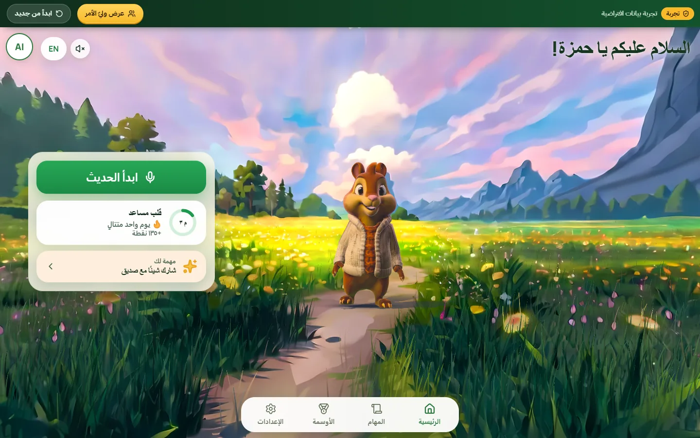</td>
</tr>
<tr>
<td>الشاشة الرئيسية القديمة (الويب في نافذة بعرض الهاتف، بالإنجليزية فقط).</td>
<td>الشاشة الرئيسية الجديدة بالواجهة العربية: الصديق واقف على ممر المرج، وبجانبه بطاقة المستوى ومهمة وزر بدء الحديث، وشارة الذكاء الاصطناعي في الأعلى. عائلة تجريبية ببيانات اصطناعية.</td>
</tr>
<tr>
<td></td>
<td></td>
</tr>
<tr>
<td>الاتصال الصوتي القديم.</td>
<td>شاشة الاتصال الجديدة بالواجهة العربية: زر التبديل بين الصوت والكتابة، وشارة «الصديق يسمعك»، وشريط المستوى، وشارة الذكاء الاصطناعي.</td>
</tr>
<tr>
<td></td>
<td>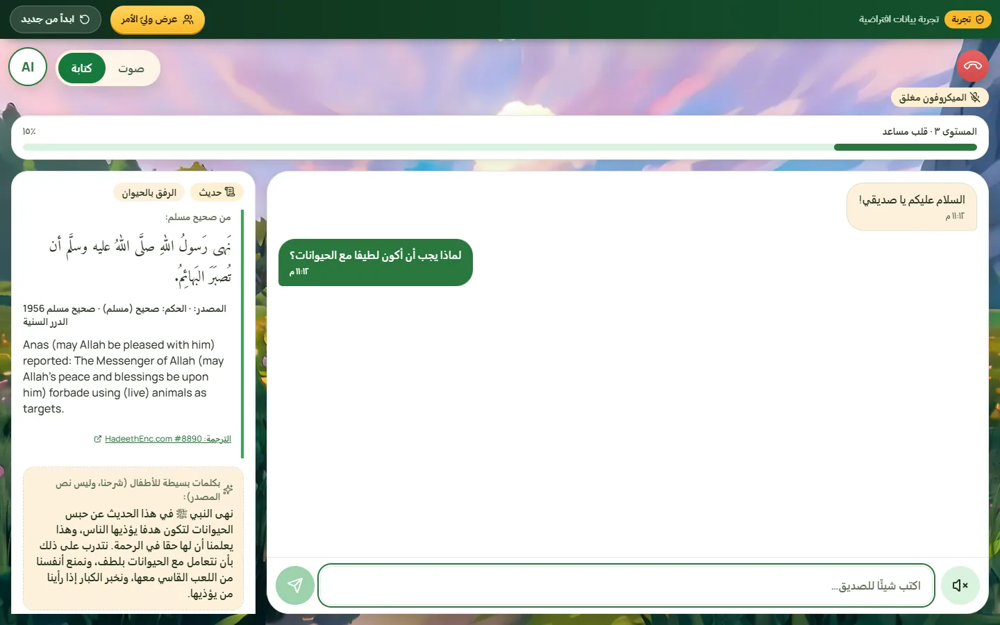</td>
</tr>
<tr>
<td>وضع الكتابة القديم: فقاعات نص بلا مصادر. الفقاعتان نص اصطناعي أدخل لأجل الصورة (لم يشغل الوكيل القديم).</td>
<td>وضع الكتابة الجديد بالواجهة العربية: سأل الطفل عن الرفق بالحيوان فظهرت بطاقة حديث (صحيح مسلم، مع الدرجة ورابط الدرر السنية) في الشريط الجانبي. البطاقة تأتي من طبقة البحث في البنك لا من النموذج، ورد النموذج غير ظاهر في هذه الصورة.</td>
</tr>
</table>

صور أخرى: [الشاشة الرئيسية بالإنجليزية](readme-media/after/home-en.webp)، [بعرض الهاتف](readme-media/after/home-en-phone-520.webp)، [الاتصال بالإنجليزية](readme-media/after/call-voice-en.webp). ومن "قبل": [تسجيل الدخول](readme-media/before/before-login-desktop.webp)، [الإنجازات](readme-media/before/before-child-achievements.webp).

#### 2.2 الشخصية ثلاثية الأبعاد

<table>
<tr><th>قبل</th><th>بعد</th></tr>
<tr>
<td></td>
<td></td>
</tr>
<tr>
<td>الشخصية القديمة (7.5 ثوان): نحو ثانيتين سكون ثم "كلام". يتحرك عظم الفك وحده على موجة ثابتة (معدل 5.5 راديان في الثانية وسعة 0.18 في <code>Avatar.jsx</code> القديم). لا رمش، ولا حركة للرأس أو العينين أو الجسم، ولا حالة إصغاء. شغل المكون القديم مع وسيط اتصال بديل.</td>
<td>الشخصية الجديدة (7.9 ثوان): سكون، ثم إصغاء، ثم كلام مع حركة يد، مع الرمش. هذا هو مكون الشخصية الحقيقي على صفحة المعاينة للمطورين، والحالة مبدلة يدويا، وليس اتصالا حيا. في الاتصال الحي تختار حالة الوكيل الحركة، ويتبع الفم الصوت.</td>
</tr>
</table>

ما الذي تغير، مع الدليل:
- النموذج: من 42,988,508 بايت (`avatar-round7.glb` عند `0241d4d`) إلى 2,480,896 بايت (`frontend/public/models/avatar/avatar-animated.glb`، وبياناته في `avatar-animated.json`: 93,335 مثلثا و32 مفصلا و30 حركة منها Idle وListen وThink وTalkGesture وBlink وWalk وWave).
- متحكم واحد في الحركة يختار الحلقة من حالة الوكيل مع انتقال ناعم، والرمش طبقة مستقلة، والرأس يلتفت نحو الكاميرا (`frontend/src/features/child/components/avatar/`، والتسليم `docs/hackathon/handoffs/06-avatar-live.md`).
- مزامنة الشفاه تحرك 14 شكلا للفم من صوت الوكيل. والمزامنة الموقتة بالنص من توقيتات ElevenLabs متاحة عبر `LIPSYNC_TIMELINE`.
- في الشاشة الرئيسية يمشي الصديق على ممر المرج ثم يسكن، وعند بدء الاتصال تقترب الكاميرا مرة واحدة إلى إطار الاتصال وتثبت (`docs/hackathon/handoffs/product-web.md`، القسم 5).

#### 2.3 المحتوى الإسلامي

<table>
<tr><th>قبل</th><th>بعد</th></tr>
<tr>
<td width="45%"></td>
<td>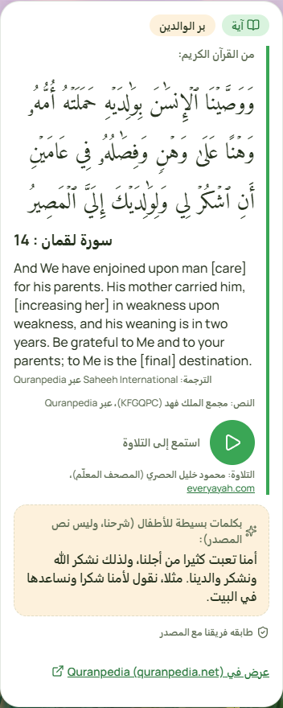 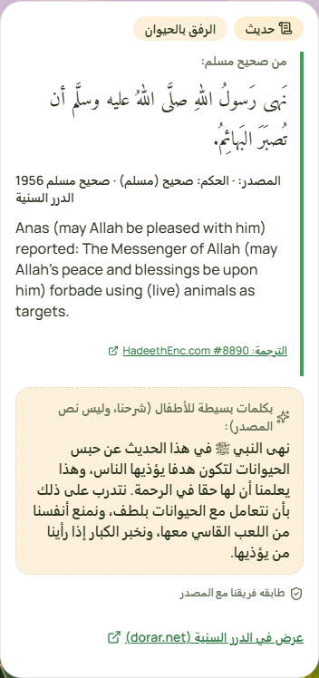</td>
</tr>
<tr>
<td>قاعدة المعرفة القديمة كما تعرضها لوحة الإدارة القديمة: 19 مرجعا (10 أحاديث و9 آيات) في 6 موضوعات، نص ترجمة إنجليزية فقط، ومصدر مكتوب نصا حرا، بلا درجة ولا رابط ولا تلاوة. أخفينا عمودي النص والمصدر: لوحة الإدارة القديمة تضع علامة «موثق» على كل الصفوف، لكن الملف لم يطابق قط مع مصدر معتمد، ويذكر كتبا خارج القائمة المعتمدة. وقد أوقف استخدامه، ولا يقرؤه أي كود للوكيل الآن.</td>
<td>بطاقتان كما يراهما الطفل في الواجهة العربية. بطاقة الآية: النص بالرسم العثماني، والمرجع، والترجمة الإنجليزية مع اسمها، والتلاوة مع اسم القارئ ورابط everyayah.com، وشرحنا في جزء مستقل، ورابط قرآنبيديا. بطاقة الحديث: صحيح مسلم مع الدرجة ومن حكم بها، وشرحنا، ورابطا الدرر السنية وموسوعة الأحاديث المترجمة.</td>
</tr>
</table>

بطاقات أخرى: [مصطلح من الجمهرة](readme-media/after/card-term-ar.png)، [سؤال من بينات](readme-media/after/card-faq-ar.png)، [آية بالإنجليزية](readme-media/after/card-verse-en.png)، [حديث بالإنجليزية](readme-media/after/card-hadith-en.png)، [مصطلح بالإنجليزية](readme-media/after/card-term-en.png)، والبطاقات داخل شاشة الاتصال: [آية](readme-media/after/call-chat-verse-ar.webp)، [مصطلح](readme-media/after/call-chat-term-ar.webp)، [سؤال شائع](readme-media/after/call-chat-faq-ar.webp). ومن "قبل": [الموضوعات الست في لوحة الإدارة القديمة](readme-media/before/before-islamic-content-admin-themes.png) (أسماؤها ووصف من سطر واحد فقط).

**البنك المراجع عند `2c04305`** (لم يتغير منذ `8c2ff0d`؛ عد عند `735c95a` من `backend/session_moral_context/content/items/*.json` ومن سجل المراجعة `content/reviewed.json`، ولم يتغير أي ملف تحت `backend/session_moral_context/` بين `735c95a` و`2c04305`؛ و`seed_content` عند `2c04305` يطبع "reviewed 273, rejected 0"):

| النوع | العدد | المصدر | ما تحمله كل مادة | راجعها (حسب السجل) |
|---|---:|---|---|---|
| آية | 74 (من 35 سورة) | نص مجمع الملك فهد بالرسم العثماني، رواية حفص، الإصدار v2-0 عبر quranpedia.net؛ ترجمة Saheeh International؛ تلاوة محمود خليل الحصري عبر everyayah.com | النص العثماني، والسورة والآية، والترجمة واسمها، ورابط التلاوة واسم القارئ | عبدالرحمن سلامة |
| حديث | 94 (صحيح البخاري 60، صحيح مسلم 34) | صفحات الأحاديث في الدرر السنية؛ والإنجليزية من HadeethEnc.com لـ 42 حديثا | النص العربي، والكتاب، والرقم، والدرجة (صحيح)، ومن حكم بها (صاحب الكتاب)، ورابط الدرر السنية | عبدالرحمن سلامة |
| تفسير | 23 | موسوعة التفسير في الدرر السنية | مقتطف قصير، ونطاق الآيات، ورابط | عبدالرحمن محملجي |
| عقيدة | 14 | الموسوعة العقدية في الدرر السنية | مقتطف قصير، ورابط، وملاحظة "قد يختلف العلماء" للمستوى ج | عبدالرحمن محملجي (13)، عبدالرحمن سلامة (1) |
| فقه | 8 | الموسوعة الفقهية في الدرر السنية | مقتطف قصير، ورابط، وسطر "معلومة عامة وليست فتوى" | عبدالرحمن محملجي |
| سيرة | 5 | الموسوعة التاريخية في الدرر السنية | مقتطف قصير، ورابط | عبدالرحمن محملجي |
| أسئلة شائعة | 23 | كتاب «بينات: أسئلة وأجوبة عن الإسلام»، dawa.center | السؤال، والجواب المختصر، ورقم السؤال والصفحة، ورابط | عبدالرحمن سلامة |
| مصطلح | 32 | معجم الجمهرة، islamic-content.com | التعريف بالعربية والإنجليزية، ورابط | عبدالرحمن سلامة |
| **المجموع** | **273** | | لكل مادة شرح للأطفال بالعربية والإنجليزية | المواد الـ 273 كلها مراجعة |

- مستويات المحتوى (مستويات التحدي من أ إلى د): أ 216، ب 54، ج 3، ولكل مادة من المستوى ج ملاحظة خلاف. وأسئلة المستوى د (الأحكام الشخصية) لا يجاب عنها من البنك بل تحال.
- لكل قيمة من القيم الـ 38 مادة واحدة على الأقل (311 ربطا بين المواد والقيم). العدد لكل قيمة في [bank-counts.md](readme-media/after/bank-counts.md).
- "مراجعة" تعني أن عضوا مسمى من الفريق طابق المادة مع مصدرها، وأن `mark_reviewed.py` حفظ بصمتها في السجل، فإذا تغيرت المادة سقطت مراجعتها. وليست موافقة عالم، والبطاقة تقول «طابقه فريقنا مع المصدر». ومراجعة ثانية للأحاديث على الدرر السنية يجريها عضو آخر ما زالت جارية.
- أجوبة المنظمين في 5 أكتوبر (الإنجليزية من HadeethEnc مع العربية من الدرر، وتلاوة everyayah مع ذكر المصدر، والاقتباس القصير من الدرر، ومن فقرة إلى ثلاث فقرات من بينات، وقبول "التوحيد" و"Monotheism" معا) موجودة في `docs/hackathon/content-approach-plan.md` القسم 12 وفي [سجل المصادر](deliverables/sources.md).
- ما يصل إليه سؤال الطفل اليوم: بطاقات الآيات والأحاديث والمصطلحات، وأسئلة بينات عبر الأسئلة العربية. أما مواد التفسير والعقيدة والفقه والسيرة فموجودة في البنك، لكن أسئلة الأطفال في تجاربنا لم تصل إليها (انظر [القيود](#ar-limits)).

#### 2.4 الصوت

| | قبل | بعد |
|---|---|---|
| تحويل النص إلى كلام | xAI Grok عبر عميل WebSocket خاص (`xai_tts_streaming.py`)، الصوت `leo` | ElevenLabs `eleven_flash_v2_5` عبر `livekit-plugins-elevenlabs==1.5.1` (`backend/requirements.agent.txt`)، بصوتين منفصلين للعربية والإنجليزية، و`TTS_PROVIDER=elevenlabs` افتراضيا |
| البديل عند العطل | لا يوجد | لا بديل تلقائي. يستطيع المشغل ضبط `TTS_PROVIDER=xai` يدويا (`.env.example`). وإذا فشل ElevenLabs تصل إلى الغرفة رسالة `voice_error` وتنتهي الجلسة بسلام |
| الآيات | قد ينطقها تحويل النص إلى كلام | نص الآية بين أقواس القرآن لا يصل أبدا إلى تحويل النص إلى كلام، والبطاقة تشغل التلاوة (`backend/conversation/agent/tts_text.py`، `scripture_guard.py`) |
| ضبط التكلفة | لا يوجد | `ELEVEN_DAILY_CHAR_CAP`: بعد الحد اليومي تبدأ جلسات العرض الجديدة بالكتابة فقط (`backend/conversation/agent/demo_limits.py`) |
| تحويل الكلام إلى نص والنموذج | OpenAI | بلا تغيير: OpenAI `gpt-4o-mini-transcribe` و`gpt-5.4-mini` (`.env.example`) |

**تكلفة التشغيل: تقدير، وليست تكلفة مقيسة** (الأسعار كما فحصت في 6 أكتوبر 2026). نحو **0.05 إلى 0.29 دولار للجلسة** من رسوم الاستخدام، من جلسة قصيرة (تحية وسؤالان، وهو الشكل الذي قيس في بروفة الحمل، ونحسبها دقيقة ونصفا) إلى جلسة كاملة مدتها 5 دقائق بنحو 10 أسئلة. والدقائق الخمس هي حد الجلسة في العرض التجريبي (`DEMO_SESSION_MAX_SECONDS=300`)، وقد تطول جلسات الأسر، وأرقام الأسر تفترض الحد نفسه. ولـ **30 محكما** بجلستين إلى 4 جلسات لكل محكم طوال فترة التحكيم (من 7 إلى 22 أكتوبر): نحو **3 إلى 34 دولارا** للفترة كلها. ولـ **100 أسرة**، بطفل واحد لكل أسرة و12 إلى 20 جلسة في الشهر: نحو **60 إلى 570 دولارا في الشهر**. وكل رقم مقرب إلى الأعلى. المنهج: وحدات مقيسة (استدعاءات OpenAI لكل جلسة من `docs/hackathon/latency/LOAD-REHEARSAL.md`؛ والرموز من `docs/hackathon/eval-reports/lead-summary.json`، حيث 6526 رمزا للإدخال و109 رموز للإخراج هي متوسط تشغيل التقييم الواحد (الوكيل والمحكم معا)، ونأخذها حدا أعلى لاستدعاء واحد للوكيل؛ وأحرف ElevenLabs: 300 حرف مقيسة لجلسة قصيرة في بروفة الحمل، و2500 حرف لجلسة كاملة، وهو تقدير البروفة نفسها) مضروبة في الأسعار المعلنة لـ `gpt-5.4-mini` (0.75 دولار لمليون رمز إدخال و4.50 لمليون رمز إخراج)، و`gpt-4o-mini-transcribe` (نحو 0.003 دولار للدقيقة، محسوبة للجلسة كلها لأن النسخ الفوري مفعل افتراضيا)، وElevenLabs Flash v2.5 (0.04 دولار لكل ألف حرف)، وLiveKit Cloud (0.0005 دولار لدقيقة المشارك، ويضيف الحد الأعلى 0.01 دولار لدقيقة جلسة الوكيل): [OpenAI](https://platform.openai.com/docs/pricing)، [ElevenLabs](https://elevenlabs.io/pricing/api)، [LiveKit](https://livekit.com/pricing). ومدة الجلسة وعدد الرسائل ورموز التقارير وطول المدخلات في آخر الجلسة الكاملة وعدد الجلسات لكل محكم أو أسرة افتراضات، ولا يشمل التقدير رسوم الباقات ولا الخادم ولا خصم التخزين المؤقت للمدخلات. الحساب في `docs/hackathon/deliverables/Presentation/deck-src/cost_estimate.py`، والمنهج في شريحتي الملحق 24 و25 من العرض.

<a id="ar-parent"></a>

#### 2.5 واجهة ولي الأمر

<table>
<tr><th>قبل</th><th>بعد</th></tr>
<tr>
<td></td>
<td>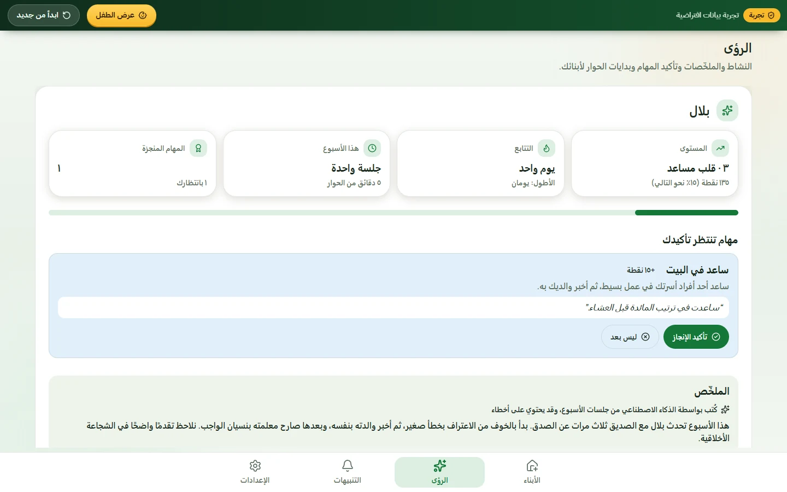</td>
</tr>
<tr>
<td>واجهة ولي الأمر القديمة لطفل: كل جلسة مع مقتطف من آخر رسالة فيها (نص اصطناعي هنا).</td>
<td>صفحة الرؤى الجديدة بالواجهة العربية (عائلة اصطناعية): المستوى، وأيام المواظبة، وجلسات هذا الأسبوع، ومهمة تنتظر تأكيد ولي الأمر، والملخص الأسبوعي وفوقه وسم يبين أن الذكاء الاصطناعي كتبه من جلسات الأسبوع وأنه قد يحتوي على أخطاء. وحقل <code>preview</code> في واجهة ولي الأمر البرمجية صار فارغا دائما (الاختبار: <code>backend/reporting/test_privacy_prompts.py</code>).</td>
</tr>
<tr>
<td></td>
<td>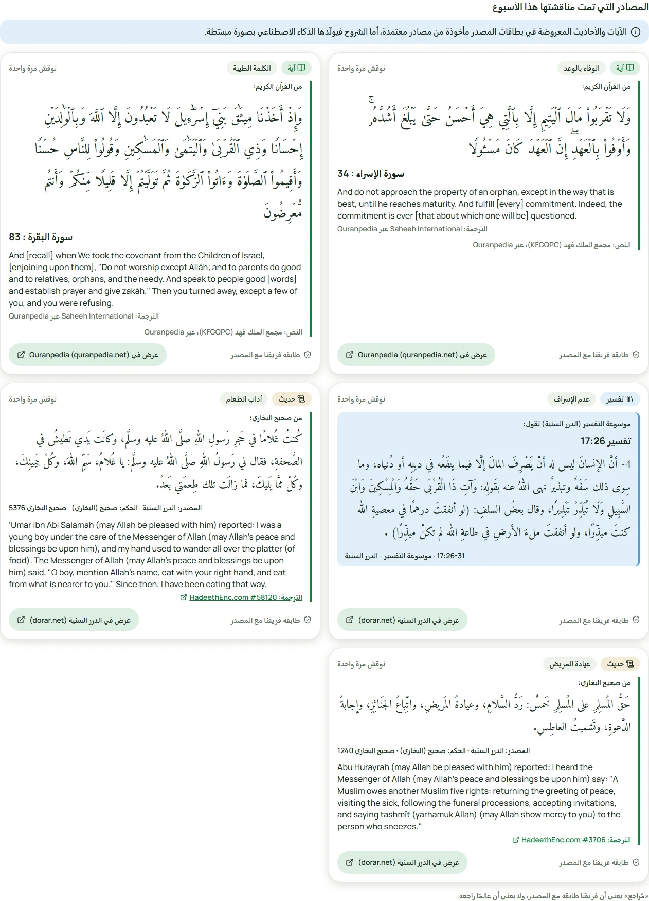</td>
</tr>
<tr>
<td>صفحة الرؤى القديمة: ملخص بلا وسم الذكاء الاصطناعي وموضوعات مقترحة، ولا شيء يبين أي آية أو حديث رآه الطفل.</td>
<td>قسم «المصادر التي تمت مناقشتها هذا الأسبوع» الجديد (دمج في PR #59، وأعيد التقاط الصورتين في 6 أكتوبر عند <code>2c04305</code> بعد PR #64): سطر ثقة، ثم بطاقة لكل مصدر رآه الطفل هذا الأسبوع. وفي هذه الصورة المصادر الخمسة التي تبذر بها إحدى العائلات التجريبية (PR #58): آيتان، وحديثان، ومقتطف من موسوعة التفسير في الدرر السنية. أما <a href="readme-media/after/parent-sources-en.webp">الصورة الإنجليزية</a> فلعائلة تجريبية أخرى: توزع المصادر على العائلات بالتناوب بحسب رقم كل عائلة، فالمصادر الخمسة فيها كلها مختلفة، وفيها مقتطف من الموسوعة العقدية مكان مقتطف التفسير. وفي كل بطاقة نوع المادة، وقيمتها إن كانت المادة مرتبطة بقيمة (ومقتطف الموسوعة العقدية في الصورة الإنجليزية غير مرتبط بقيمة)، وعدد مرات النقاش، وعنوان المادة إن كان لها عنوان (يظهر منذ PR #64، ولا يظهر على بطاقة آية)، والنص العربي، والمرجع (السورة والآية، أو كتاب الحديث ورقمه ودرجته، أو اسم الموسوعة)، والترجمة الإنجليزية إن كانت للمادة ترجمة (ولا ترجمة لمقتطف الموسوعة)، وعبارة «طابقه فريقنا مع المصدر»، ورابط المصدر. وفي الأسفل سطر يوضح أن «مراجع» يعني أن فريقنا طابقه مع المصدر، ولا يعني أن عالما راجعه. عائلة تجريبية ببيانات اصطناعية.</td>
</tr>
</table>

كيف تصل المصادر إلى ولي الأمر: كل بطاقة تعرض في الاتصال تحفظ في `ServedReference`. وبعد انتهاء الاتصال تنسخها `post_session_pipeline` إلى `SessionReport.sources_used` من قاعدة البيانات، ولا تؤخذ من النموذج أبدا (`build_sources_snapshot` في `backend/reporting/services.py`). وتعيد واجهة الرؤى البرمجية مصادر هذا الأسبوع، مدموجة لكل مادة، في الحقل `sources` (`weekly_sources`؛ `backend/reporting/views.py`؛ والاختبار `backend/reporting/test_sources.py`). والقسم هو `SourcesDiscussed` في `frontend/src/features/parent/components/InsightsTrust.jsx`، وترسمه `ParentSourceCard.jsx`، ويعرض في `frontend/src/pages/parent/InsightsPage.jsx`. وكل مصدر يمر أولا بالدالة `normalizeReference` نفسها التي تمر بها بطاقة الطفل، فتنطبق عليه فحوص الرابط والدرجة نفسها (الإيداع `7d2a3b3`). ويليه قسما «قيم هذا الأسبوع» و«الأسئلة للنقاش» إذا وجدت لهما بيانات. وكل عائلة تجريبية تبذر بمصادر مؤرخة بهذا الأسبوع: حديثان لهما نص إنجليزي، وآيتان، ومادة من نوع آخر، تتغير من عائلة إلى أخرى (PR #58، الدالة `_seed_sources` في `backend/demo/services.py`، والاختبارات في `backend/demo/tests.py`).

ولا يرى ولي الأمر كلام الطفل نفسه. فمنذ PR #62 تحذف من تقرير الجلسة ومن الملخص الأسبوعي، قبل حفظهما، كل جملة تكرر 6 كلمات متتالية من رسالة للطفل (أو الرسالة كلها إن كانت من 4 أو 5 كلمات)، مع توحيد صور الكتابة العربية مثل الهمزات والتشكيل، وتحذف الموضوعات المقترحة التي تفعل ذلك (`strip_child_echo` في `backend/reporting/services.py`، والاختبارات في `backend/reporting/test_privacy_prompts.py`). والمطابقة بالكلمات، فإعادة صياغة كلام الطفل تمر ([القسم 7](#ar-limits)).

وأيضا: [المصادر بالإنجليزية](readme-media/after/parent-sources-en.webp)، [التنبيهات بالعربية](readme-media/after/parent-alerts-ar.webp)، [الرؤى بالإنجليزية](readme-media/after/parent-insights-en.webp)، [التنبيهات بالإنجليزية](readme-media/after/parent-alerts-en.webp)؛ ومن "قبل": [التنبيهات](readme-media/before/before-parent-alerts.webp)، [الأطفال](readme-media/before/before-parent-children.webp).

#### 2.6 السلامة والاستناد إلى المصادر

ما يعمل في كل رسالة، صوتية كانت أو مكتوبة (`backend/conversation/agent/turn_policy.py`، `turn_pipeline.py`، والقواعد في `backend/session_moral_context/content/turn_rules.json`):

1. **السلامة أولا.** الأذى والإساءة والاستدراج (طلب الكتمان، والهدايا، والعزل، والتواصل عبر الإنترنت) وطلبات المعلومات الشخصية تذهب إلى رد سلامة وبلاغ سلامة. وإذا كان الشخص الموصوف قد يكون في البيت، تسجل الحالة لفريق العمل ولا يرسل تنبيه لولي الأمر. الاختبارات: `conversation/test_distress_gate.py`، `conversation/agent/test_safety_classes.py`.
2. **المواساة.** الطفل الحزين أو الخائف أو الوحيد يلقى مواساة ويوجه إلى شخص بالغ يثق به، ولا يعطى آية ولا درسا. وإذا وصفت هذه الرسالة أذى ولم تطابق أي قاعدة سلامة، تطلب تعليمات المواساة من النموذج أن يرفع بلاغ السلامة، فيكون البلاغ هنا معتمدا على النموذج ([القيود المعروفة](deliverables/known-limitations.md)).
3. **لا مصدر، لا جواب.** السؤال الديني الذي لا يوجد له شيء في البنك يعتذر عنه الصديق بأنه لا يملك مصدرا موثوقا، ويقترح سؤال ولي الأمر أو المعلم. ويرفض طلب اختراع حديث أو التلاوة من الذاكرة. ويزيل حارس المخرجات نسبة الأقوال بلا مصدر، ويمنع نص الآيات من الوصول إلى الكلام المنطوق (`scripture_guard.py`).
4. **المستويات.** الأحكام الشخصية (المستوى د) تحال إلى ولي الأمر أو عالم، والمسائل الخلافية (المستوى ج) يبين فيها أن العلماء يختلفون وتحال.
5. **بوابة البطاقات** (دمجت في PR #56، `8c2ff0d`). لا تظهر بطاقة إلا إذا سأل الطفل عن موضوع إسلامي أو عن قيمة. وكلمة القيمة في حديث عادي (مثل "كنت صادقا مع معلمي اليوم") تلقى ردا دافئا بكلمات الصديق دون بطاقة. والتحية والشكر («شكرا»، والسلام) يرد عليها بمثلها ولا تجلب بطاقة أبدا. ويعيد `TURN_CARD_GATE=0` السلوك القديم. الاختبارات: `conversation/test_card_gate.py`.
6. **المقتطفات تبقى في البطاقة.** مقتطفات التفسير والعقيدة والفقه والسيرة والأسئلة الشائعة لا تعطى للنموذج أبدا، بل يعطى المرجع وشرحنا الموسوم (`retrieval.py`، `_CARD_ONLY_TYPES`).
7. **الترغيب قبل الترهيب.** الحديث عن الجنة والنار والمحاسبة يبدأ بالرجاء ولا يكون مخيفا بالتفاصيل، وهذا قرار قائد الفريق بعد استشارة أحد العلماء في 5 أكتوبر. توجيه الشخصية هو `_HOPE_AND_ACCOUNTABILITY` في `agent_class.py` (الإيداع `459cdd7`)، ومرشحات المحتوى المرافقة له وتسجيل استشارة العالم في الإيداع `c01f25a`.
8. **الإفصاح عن الذكاء الاصطناعي.** يقول الصديق إنه ذكاء اصطناعي وليس إنسانا، وسؤال "من صنعك" له جواب ثابت بلا أسماء شركات. وشارة دائمة تفتح ورقة معلومات باللغتين فيها رابط صفحة الخصوصية.

**المراجعة الأمنية** (PR #62): فحصت كل نقطة في الواجهة البرمجية تأخذ معرفا، حتى لا تصل عائلة إلى بيانات عائلة أخرى. ومن الإصلاحات المدمجة: لا يرى ولي الأمر تنبيهات الطفل إلا ما دام ربطه بالطفل معتمدا، ورمز دخول الطفل إلى غرفة LiveKit صار صالحا 10 دقائق افتراضيا بدل 6 ساعات (والعرض التجريبي يستخدم مدة الجلسة مع دقيقتين)، وبيئة الإنتاج ترفض العمل بمفتاح LiveKit السري المخصص للتطوير والمنشور في المستودع، ومرشح كلام الطفل في [القسم 2.5](#ar-parent). والبنود التي تركتها لقائد الفريق مذكورة في ذلك الملف.

**الجولة الأمنية الثانية** (PR #65): صار مرشح كلام الطفل يعمل أيضا عند كتابة تقرير الجلسة، على الحقول التي يراها ولي الأمر وعلى النص الذي يبنى منه الملخص الأسبوعي، وتسقط المهمة التي يكرر عنوانها كلام الطفل (`backend/reporting/test_echo_write_time.py`)؛ ومسح ثان لنقاط الواجهة البرمجية أصلح صرف مكافأة المهمة مرتين عند إتمامها في وقت واحد، وتعطل استعادة كلمة المرور بسبب حساب يختلف بريده في حالة الأحرف فقط، ونصا برمجيا مخزنا في لوحة المشرف العام التي صارت واجهتها البرمجية للقراءة فقط (`backend/authentication/test_authz_sweep2.py`، `backend/superadmin/test_security_audit.py`)؛ وصارت حدود الطلبات تحسب في ذاكرة مؤقتة واحدة تشترك فيها كل العمليات، وهي Redis إذا كان مضبوطا، مع بديل داخل كل عملية إن تعطل، وأضيفت حدود لاستعادة كلمة المرور وتجديد رمز الدخول وبدء الجلسات (`backend/config/test_throttling.py`)؛ ويرسل Caddy ترويسات أمان وسياسة Content-Security-Policy في وضع الإبلاغ فقط، غير مفروضة بعد (`infra/caddy/Caddyfile`، `frontend/tests/security.test.mjs`). **PR #66**: إذا أتم طرف آخر المهمة قبل الصديق، يعيد استدعاء الإتمام من الصديق رسالة بدل خطأ (`backend/conversation/agent/test_quest_race.py`)، ويضبط `AUTH_RATE` حد تسجيل الدخول.

<table>
<tr><th>ورقة شارة الذكاء الاصطناعي</th><th>صفحة الخصوصية</th></tr>
<tr>
<td>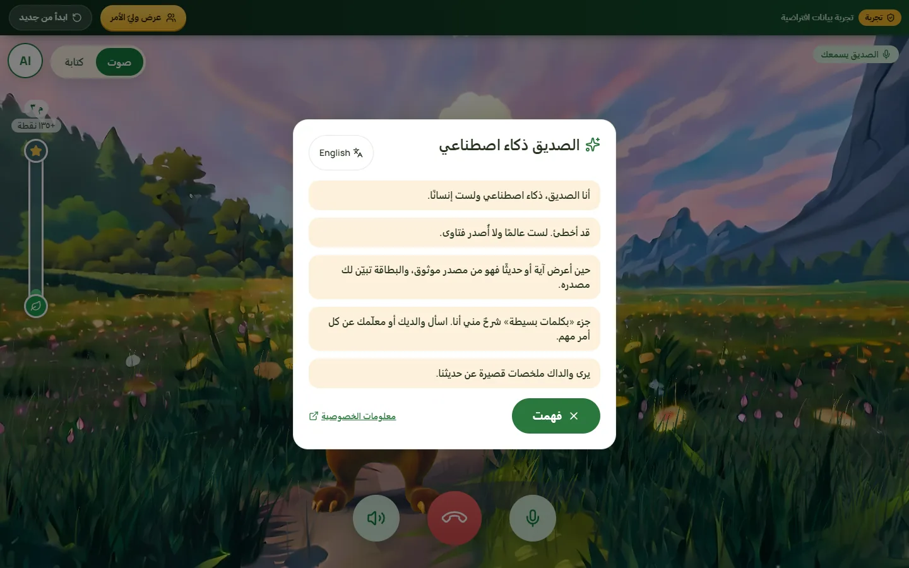</td>
<td>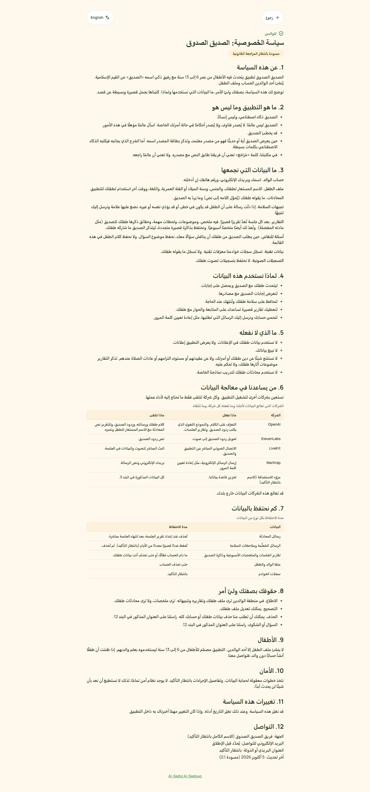</td>
</tr>
<tr>
<td>ورقة الذكاء الاصطناعي: خمسة أسطر (صديق ذكاء اصطناعي وليس إنسانا؛ قد يخطئ، وليس عالما ولا يصدر فتاوى؛ الآيات والأحاديث من مصدر موثوق؛ جزء «بكلمات بسيطة» شرح منه؛ يرى الوالدان ملخصات قصيرة). بالإنجليزية: <a href="readme-media/after/ai-chip-sheet-en.webp">صورة</a>.</td>
<td>صفحة <code>/privacy</code> العامة بالعربية والإنجليزية، وما زالت تحمل شارة «مسودة بانتظار المراجعة القانونية». بالإنجليزية: <a href="readme-media/after/privacy-en.webp">صورة</a>.</td>
</tr>
</table>

<a id="ar-results"></a>

### 3. النتائج المقيسة

لكل رقم أدناه مصدره وظروف قياسه، وما لم نقسه لا نذكره. لم يكن لمشروع التخرج (`0241d4d`) نظام تقييم، فلا يوجد خط أساس منه، و"قبل" تعني نسخة الهاكاثون الأسبق المذكورة في كل صف.

| ما قيس | قبل | بعد | طريقة القياس | المصدر |
|---|---|---|---|---|
| تقييم القواعد: كل حالة على القناتين، بلا استدعاء للنموذج | 338 نجاح، 24 فشل، 30 فجوة محتوى (392 تشغيلا) عند `97f26aa` قبل PR #56 | **340 نجاح، 22 فشل، 30 فجوة محتوى** عند `2c04305`، وهي المخرجات نفسها عند `8c2ff0d` (PR #56) وعند `08075e1` و`735c95a` | `python manage.py run_eval --settings=config.settings_sqlite_test --no-fail`؛ شغلنا `97f26aa` و`8c2ff0d` في 5 أكتوبر، و`08075e1` و`735c95a` و`2c04305` في 6 أكتوبر | مخرجات الأمر ([القسم 6](#ar-tests)) |
| فئة السلامة في التقييم نفسه | 92 من 92 | 92 من 92 | التشغيل نفسه | نفسه |
| تقييم النموذج الحي، المجموعة المحجوزة (حالات لم تستخدم في الضبط)، نجاح صارم | 10 من 40 = 25% | **18 من 41 = 44%**؛ الفرق على الحالات نفسها +20.5 نقطة (فترة ثقة 95% من +5.1 إلى +35.9)، واختبار McNemar الدقيق p = 0.039 | قبل = فرع بنك المعرفة `4fccb39`، بعد = نسخة المنتج `dba765e`؛ الوكيل `gpt-5.4-mini` ومحكم آلي، نص فقط، تشغيل واحد لكل جانب | [eval-reports/README.md](eval-reports/README.md) |
| التقييم نفسه، فئة السلامة، نجاح صارم | 12% | 72% | 25 تشغيلا في القسمين | نفسه |
| تشغيل القواعد التجريبي، 186 حالة، دون فجوات المحتوى | 137 من 158 = 87% | 153 من 158 = 97% | بلا استدعاء للنموذج | نفسه |
| مؤشر تقريبي لدروس في غير موضعها، قبل بوابة البطاقات وبعدها | 51.5% على مجموعة اختبار قائد الفريق؛ 45.5% على مجموعته المحجوزة | **0%** على الاثنتين؛ رسائل اللطف أو التحية التي ظهرت فيها بطاقة 0 من 55؛ والأسئلة التي يجب أن تظهر لها بطاقة ظهرت لها 40 من 40 | مجموعات اختبار قائد الفريق الخاصة (ليست في هذا المستودع)، قبل PR #56 وبعده، 5 أكتوبر. مؤشر تقريبي وليس نسبة محكمة، ولم نعد قياسه؛ وما زالت حالة واحدة من الحديث العادي في المجموعة المحجوزة (`heldout-02-ar`) تجلب آيات في تشغيلنا للقواعد | وصف قائد الفريق لطلب الدمج PR #56، منقولا بصياغته في [quality-gate-summary.md](eval-reports/quality-gate-summary.md) |
| بوابة جودة المحادثة: مجموعات قائد الفريق المختومة (610 رسائل و20 محادثة)، يحكم عليها Opus بمعيار القائد، وفيها 11 صفا لكل منها هدف | تفشل الصفوف الـ 11 كلها عند `d794bc7` (5 أكتوبر): 37 هلوسة؛ دروس في غير موضعها 19.8% من الرسائل العادية و59.1% من التحيات والشكر والوداع؛ الاستناد إلى مصدر 46.7%؛ الاعتذار دون كلام من الذاكرة 89.3%؛ الإحالة 66.7%؛ لا تأكيد ولا نفي 83.3%؛ مسار الطمأنة أو الأمان 63.6%؛ الهوية 93.3%؛ جودة الصداقة 3.61 للرسالة و2.35 للمحادثة | **ينجح صفان من 11** عند `8cbe64a` (6 أكتوبر): الدروس في غير موضعها **9.9%** (الهدف 10% أو أقل، نجح بفارق 0.1 نقطة) والهوية **100%**. وما زال يفشل: **34 هلوسة** (الهدف 0؛ 33 حكم بها المحكم، وواحدة إنذار كاذب من أداة القياس)؛ والتحيات 4.5%؛ والاستناد إلى مصدر 68.9%؛ والاعتذار 78.6% (تراجع)؛ والإحالة 83.3%؛ ولا تأكيد ولا نفي 83.3%؛ ومسار الطمأنة أو الأمان 63.6%؛ وجودة الصداقة 3.96 للرسالة و3.20 للمحادثة (الهدف 4) | قبل = النسخة `d794bc7` قبل بوابة البطاقات (PR #56)، و74 آية متاحة؛ بعد = فرع `hackathon` عند `8cbe64a` (كود المنتج نفسه عند `2c04305`)، مع بوابة البطاقات والمواد المراجعة الـ 273. وفي الاثنين: الوكيل ومحاكي الطفل `gpt-5.4-mini`، وقناة الصوت، وتشغيل واحد لكل جانب، ونتيجة الشيفرة تغلب حكم المحكم. ورسائل الشخصيات بعد الافتتاحية يكتبها المحاكي، فتختلف بين التشغيلين | [quality-gate-summary.md](eval-reports/quality-gate-summary.md) القسمان 1 و3: الأرقام فقط، لأن التقرير الكامل يسمي جمل الاختبار المختومة ويقتبسها |
| الزمن حتى أول صوت | لم يقس | نحو 2.6 ثانية من نهاية كلام الطفل إلى الرد، ونحو 3.0 ثوان للتحية، ثابت عند 1 و5 و10 جلسات متزامنة | نسخة Docker محلية مع OpenAI وElevenLabs حقيقيين ومتصفحات بلا واجهة | [latency/LOAD-REHEARSAL.md](latency/LOAD-REHEARSAL.md) |
| اختبارات الخادم | | **نجح 1686 اختبارا، وتخطى التشغيل اختبارين** (من 1688 اختبارا) عند `2c04305` | `python manage.py test --settings=config.settings_sqlite_test`، تشغيل متسلسل مثل `--parallel 1`، شغلناه في 6 أكتوبر داخل صورة Docker الخاصة بوكيل المشروع | مخرجات الأمر |
| فحوص الواجهة | | lint نظيف، والبناء ناجح، و`check:cards` ناجح، و`test:i18n` 13 من 13، واختبار الأمان 6 من 6، عند `2c04305` | `npm ci` ثم أوامر npm و`node --test tests/security.test.mjs` (PR #65)، شغلناها في 6 أكتوبر | مخرجات الأوامر |

التشغيل الأول لبوابة الجودة هو سبب بناء بوابة البطاقات: 25 من الهلوسات الـ 37 جاءت من بطاقة ظهرت بسبب كلمة مفتاحية ثم تجاوزها النموذج بكلامه، وكل تحية أو شكر تحول إلى درس كان بطاقة جلبتها كلمة مفتاحية. وتبين إعادة القياس أن بوابة البطاقات أدت هذا الدور: نزلت البطاقات في الرسائل العادية من 27 إلى 2 من 162، ونزلت الدروس في غير موضعها من 19.8% إلى 9.9%، وارتفعت جودة الصداقة في الرسائل التي ظهرت فيها بطاقة من 2.53 إلى 3.23 (ومن 4.00 إلى 4.15 في الرسائل التي لا بطاقة فيها). لكنها لم تعالج الهلوسة: من الهلوسات الـ 34 جاءت 21 من كلام النموذج نفسه بجانب بطاقة معروضة أو منسوبا إليها (17 منها في أسئلة دينية حقيقية)، و11 من الذاكرة دون أي مادة معروضة، وواحدة عبارة «اختلف العلماء»، وواحدة إنذار كاذب من أداة القياس. ونزل الاعتذار من 89.3% إلى 78.6%، وارتفعت الإنذارات الكاذبة في الرسائل العادية ورسائل القيم الخفيفة من 2 إلى 4 من 224. ونسبة 9.9% المحكمة ومؤشر القائد التقريبي 0% في الصف الذي قبله مقياسان مختلفان: المؤشر يعد قرارات البطاقات في سياسة الدور، دون نموذج، على مجموعات القائد الخاصة، أما المحكم فيعد أيضا التوجيه السلوكي الذي لا بطاقة معه (14 من الرسائل الـ 16). وتحفظات التقييم الحي (من تقريره): تشغيل واحد لكل جانب، وحالات كتبها الفريق ويحكم عليها نموذج، والقناة النصية فقط، و"قبل" هي فرع بنك المعرفة لا وكيل مشروع التخرج.

<a id="ar-try"></a>

### 4. جربه: عرض المحكمين

1. افتح https://alsadiqai.com بعد نشر نسخة الهاكاثون (انظر الحالة في الأعلى)، أو شغله بنفسك ([القسم 5](#ar-run)).
2. اضغط **«جرب الصديق»**. تحصل على عائلة اصطناعية لمدة 45 دقيقة، بلا تسجيل ولا كلمة مرور.
3. اضغط زر بدء الحديث، وانتقل إلى **«كتابة»** إن كنت تفضل الكتابة.
4. اتبع [docs/hackathon/DEMO.md](DEMO.md): كل جملة للطفل فيه فحصت على طبقة القواعد عند `2c04305` (أي بطاقة تظهر، أو أي إحالة). اكتب الجمل كما هي، فتحويل الكلام إلى نص قد يغير الصياغة.
5. اضغط **«عرض ولي الأمر»** لترى العائلة نفسها كولي أمر، وفي **«الرؤى»** قسم «المصادر التي تمت مناقشتها هذا الأسبوع». واضغط **«ابدأ من جديد»** لإعادة الضبط.

<a id="ar-run"></a>

### 5. تشغيله بنفسك

تحتاج Docker مع Compose. ردود الصوت والكتابة تحتاج مفاتيحك الخاصة لـ OpenAI وElevenLabs؛ أما الواجهة وتسجيل الدخول التجريبي وواجهة ولي الأمر والتقييم والاختبارات فتعمل بدونها.

<div dir="ltr">

```bash
git clone <repository-url> Alsadiq-Alsadouq
cd Alsadiq-Alsadouq
cp .env.example .env
# In .env set: OPENAI_API_KEY, ELEVEN_API_KEY, ELEVEN_VOICE_ID_AR, ELEVEN_VOICE_ID_EN,
#              DEMO_MODE=1 and VITE_DEMO_MODE=1 (the one-tap demo).
# The LiveKit development keys in .env.example match infra/livekit/livekit.yaml.
docker compose --profile all up --build
```

</div>

ثم افتح http://localhost:5173 واضغط **«جرب الصديق»**. حاوية الخادم تشغل `migrate` و`migrate --check` و`seed_admin` و`seed_content` عند البدء (`docker-compose.yml`)، فتحمل المواد الـ 273. وأول بدء للعرض التجريبي ينشئ العائلات الاصطناعية الأربعين، ويمكنك أيضا تشغيل `docker compose exec backend python manage.py seed_demo --ensure`.

| الخدمة | الرابط |
|---|---|
| تطبيق الويب | http://localhost:5173 |
| واجهة الخادم البرمجية ولوحة إدارة Django | http://localhost:8000، http://localhost:8000/admin |
| LiveKit (خادم التطوير) | ws://localhost:7880 |

نسخة التطوير تفتح منفذي Postgres وRedis على 127.0.0.1 فقط (`docker-compose.yml`، PR #62)، وتعمل بـ `DEBUG=1`، والإعدادات تعد `DEBUG` غير المضبوط بيئة إنتاج.

بيئة الإنتاج تعمل بـ `docker-compose.prod.yml` خلف Caddy مع LiveKit Cloud، و`DEBUG` فيها معطل ما لم يضبطه ملف `.env` على الخادم. وحين يكون `DEBUG` معطلا يرفض الخادم العمل إذا كان `DJANGO_SECRET_KEY` غير مضبوط أو فارغا، أو إذا كان `LIVEKIT_API_SECRET` فارغا أو بقي على سر LiveKit التطويري الموجود في `.env.example` (`backend/config/settings.py`). ولا يفحص الخادم قيمة مفتاح Django نفسها، فالقيمة المؤقتة `change-me-to-a-random-secret-key` في `.env.example` مقبولة، ويجب استبدالها يدويا. وسير النشر (`.github/workflows/deploy.yml`، الطلبان #60 و#61) يبني الصور، وتجمع الملفات الثابتة أثناء بناء الصورة؛ ثم يتحقق من ملف Caddyfile؛ ثم يشغل `migrate` و`migrate --check` في حاويات مؤقتة قبل `up -d`؛ ثم يعيد إنشاء Caddy ليحمل أي تعديل في Caddyfile؛ ثم يشغل `seed_content`، و`seed_demo --ensure` إذا كان `DEMO_MODE` مفعلا؛ ويفشل التشغيل إن لم يرد `/api/health/` (قاعدة البيانات وRedis) بالرمز 200 عبر Caddy. وخطوات النشر في [docs/hackathon/DEPLOY-CHECKLIST.md](DEPLOY-CHECKLIST.md) وإعدادات العرض التجريبي في [docs/hackathon/DEMO-LOGIN.md](DEMO-LOGIN.md). لا ترفع ملف `.env` إلى المستودع أبدا.

<a id="ar-tests"></a>

### 6. الاختبارات

الخادم، دون حاجة إلى Postgres. مجموعة الاختبارات تستورد `livekit.agents`، لذا ثبت متطلبات الوكيل (وهي تشمل `requirements.txt`):

<div dir="ltr">

```bash
cd backend
pip install -r requirements.agent.txt
python manage.py test --parallel 1 --settings=config.settings_sqlite_test
# 6 Oct, 2c04305: Ran 1688 tests, OK (skipped=2)   -> 1686 passed, 2 skipped

python manage.py run_eval --settings=config.settings_sqlite_test --no-fail
# 6 Oct, 2c04305: runs 392: pass 340, fail 22, content-gap 30
```

</div>

تقييم النموذج الحي (`run_eval --llm`) يحتاج مفتاح OpenAI وله حد للاستدعاءات، وطريقة تشغيله في [docs/hackathon/eval-reports/README.md](eval-reports/README.md).

الواجهة:

<div dir="ltr">

```bash
cd frontend
npm ci
npm run lint
npm run build
npm run check:cards
npm run test:i18n
node --test tests/security.test.mjs
# 6 Oct, 2c04305: lint clean, build OK (chunk-size warning only),
# check:cards passed, test:i18n 13 of 13, security test 6 of 6
```

</div>

<a id="ar-limits"></a>

### 7. القيود المعروفة

القائمة الكاملة مع روابط الكود: [docs/hackathon/deliverables/known-limitations.md](deliverables/known-limitations.md). وأهمها:

- **ليس عالما.** "مراجعة" تعني أن عضوا من الفريق طابق المادة مع مصدرها، ولم يراجع البنك عالم. والمراجعة الثانية للأحاديث على الدرر السنية ما زالت جارية.
- **قواعد لا فهم.** طبقة القواعد تعمل على الكلمات، وقد تفوتها صياغات جديدة: 22 تشغيلا في تقييم القواعد تفشل، منها أسئلة المنظمين النموذجية. سؤال الكعبة بالعربية تظهر له ثلاث آيات من قيم لا علاقة لها بالسؤال، هي رعاية اليتيم والوفاء بالعهد (93:9 و2:220 و17:34؛ الحالة `tq01-kaaba-ar`). وسؤال الكعبة بالإنجليزية يظهر له مصطلح الصلاة وآيتان عن الصلاة (20:14 و2:153؛ `tq01-kaaba-en`). وسؤال «من كتب القرآن» يظهر له مصطلح القرآن، ومعه بالعربية الآيتان 20:114 و39:9، بدل جواب بينات (`tq02-quran-author-ar` و`tq02-quran-author-en`). وفئة أسئلة الاختبار: 28 نجاح و8 فشل و16 فجوة محتوى.
- **ليس كل نوع من المواد يمكن الوصول إليه.** تعرض 3 مواد على الأكثر في كل رسالة (`MAX_ITEMS = 3`)، تختار بدرجة تطابق الكلمات المفتاحية، ونوع المادة لا يرجح إلا عند التساوي (`match_values` في `backend/conversation/agent/retrieval.py`). وفي تجاربنا بأسئلة الأطفال لم تصل بطاقات التفسير والعقيدة والفقه والسيرة إلى المواد الثلاث الأولى. ووصلت أسئلة بينات عبر الأسئلة العربية فقط.
- **قد يخطئ النموذج بكلامه.** الشروح حول البطاقة مولدة، والحراس يزيلون النصوص الشرعية ونسبة الأقوال بلا مصدر، لا كل خطأ ممكن. وفي إعادة قياس بوابة الجودة المحكمة في 6 أكتوبر (مجموعات القائد المختومة، 610 رسائل) ما زالت تعد 34 هلوسة (33 حكم بها المحكم، وواحدة إنذار كاذب من أداة القياس؛ وكانت 37 قبل بوابة البطاقات)، وأخذت 4 من 224 رسالة عادية أو رسالة قيم خفيفة مسار أمان لم تكن تحتاجه ([القسم 3](#ar-results)).
- **مسارات حية لم يعد اختبارها كاملة.** الردود الصوتية المقطوعة وكل المسارات الحية لم تفحص من البداية إلى النهاية، وتباين النتائج بين تشغيلات متكررة للتقييم الحي لم يقس.
- **صفحة الخصوصية مسودة** بانتظار المراجعة القانونية، وبعض عباراتها تحتاج تأكيد الفريق.
- **الاعتماديات.** لا بديل تلقائي لـ OpenAI (تحويل الكلام إلى نص والنموذج) ولا لـ ElevenLabs (الصوت)، وإذا نفد رصيد OpenAI تفشل الردود.
- **التلاوة.** مشغل بطاقة الآية يبث التلاوة من everyayah.com (`audio_url`)، فيحتاج أن يكون الموقع متاحا. أما نسخ المقاطع الـ 74 التي تقدم من `/static/quran/` فتستخدم فقط لعلامات الآيات داخل النص ([القسم 8](#ar-third-party)).
- **مصادر ولي الأمر تحتاج اتصالا منتهيا.** بطاقات الاتصال الجديد لا تظهر في «المصادر التي تمت مناقشتها هذا الأسبوع» إلا بعد انتهاء الاتصال وكتابة تقريره (`post_session_pipeline`)، والعائلات التجريبية تبدأ بمصادر مبذورة ([القسم 2.5](#ar-parent)).
- **مرشح كلام الطفل يطابق الكلمات.** يحذف من الملخص الجمل التي تنقل سلسلة من كلمات الطفل، أما إعادة صياغة ما قاله الطفل فتصل إلى ولي الأمر. والملخص الأسبوعي لا يرى إلا الرسائل التي عليها بلاغ، لأن غيرها يحذف بعد كل تقرير (التدقيق الأمني، PR #62، البند H1).

<a id="ar-third-party"></a>

### 8. المصادر والخدمات والأصول الخارجية

توجيه المنظمين الأهم كان توثيق كل مصدر. ترخيصنا لا يشمل شيئا مما في هذا القسم، وكل بند يبقى على شروط صاحبه.

**المحتوى الإسلامي (بنك الـ 273 مادة)**

| المصدر | الاستخدام | الشروط والإذن |
|---|---|---|
| مجمع الملك فهد لطباعة المصحف الشريف، النص العثماني برواية حفص، الإصدار v2-0 | النص العربي للآيات الـ 74 | https://qurancomplex.gov.sa/ ؛ يقرأ عبر قرآنبيديا، وقبله المنظمون (5 أكتوبر) |
| قرآنبيديا | مصدر قراءة نص الآيات (المصحف 2) والرابط في كل بطاقة آية | https://quranpedia.net/ |
| ترجمة Saheeh International عبر قرآنبيديا | السطر الإنجليزي تحت كل آية، مع ذكر اسمها في البطاقة | عبر https://quranpedia.net/ |
| everyayah.com، تلاوة محمود خليل الحصري | التلاوة في كل بطاقة آية، مع ذكر المصدر ورابطه. مشغل البطاقة يشغل المقطع من everyayah.com (`audio_url`). والمقاطع الـ 74 نفسها (ملفات mp3، حجمها 41.9 ميغابايت) محفوظة أيضا في هذا المستودع في `backend/session_moral_context/static/quran/` (منذ الإيداع `73a4db9`، 4 أكتوبر)، وتقدمها صورة الخادم وحدها من `/static/quran/`، وهي البديل لعلامات الآيات داخل النص | https://everyayah.com/ ؛ قبلها المنظمون بشرط إظهار اسم المصدر ورابطه (5 أكتوبر). وقرر قائد الفريق في 6 أكتوبر إبقاء الملفات الـ 74 في المستودع مع هذا الإسناد إلى everyayah.com |
| الدرر السنية (dorar.net): صفحات الأحاديث وموسوعات التفسير والعقيدة والفقه والتاريخ | 94 حديثا (النص والدرجة ومن حكم بها)، و23 مقتطف تفسير، و14 عقيدة، و8 فقه، و5 سيرة | https://dorar.net/ ؛ أجاز المنظمون الاقتباس القصير مع الرابط ومع تبسيطنا الموسوم للأطفال (5 أكتوبر) |
| موسوعة الأحاديث النبوية المترجمة (HadeethEnc.com) | البحث عن الأحاديث بالموضوع، والنص الإنجليزي لـ 42 حديثا برابطه الخاص | https://hadeethenc.com/ ؛ قبلت للإنجليزية بجانب العربية من الدرر (5 أكتوبر) |
| كتاب «بينات: أسئلة وأجوبة عن الإسلام» (dawa.center) | 23 سؤالا شائعا، من فقرة إلى ثلاث فقرات لكل سؤال مع رقمه وصفحته | https://dawa.center/file/7937 ؛ أجازه المنظمون (5 أكتوبر) |
| معجم الجمهرة (islamic-content.com) | 32 مصطلحا بتعريفها العربي والإنجليزي | https://islamic-content.com/dictionary |

**خدمات وقت التشغيل**

| الخدمة | الاستخدام | الشروط |
|---|---|---|
| OpenAI API | تحويل الكلام إلى نص (`gpt-4o-mini-transcribe`)، ونموذج المحادثة وتقارير ما بعد الجلسة (`gpt-5.4-mini`) | https://openai.com/policies/ |
| ElevenLabs | تحويل النص إلى كلام (`eleven_flash_v2_5`)؛ وأيضا أصوات «همم» القصيرة السبعة التي تملأ لحظات الانتظار، ولدت مرة واحدة بـ ElevenLabs وحفظت في `backend/conversation/agent/assets/fillers/` (`render_fillers.py` وملف `README.md` فيه) | https://elevenlabs.io/terms-of-use |
| LiveKit (Agents 1.5.1 والخادم ومكتبات العميل؛ LiveKit Cloud في الإنتاج) | غرف الصوت الفورية | المكتبات بترخيص Apache-2.0: https://github.com/livekit/agents/blob/main/LICENSE ؛ الخدمة السحابية: https://livekit.io/legal/terms-of-service |
| xAI Grok TTS | خيار رجوع يدوي للمشغل فقط، معطل افتراضيا | https://x.ai/legal/terms-of-service |
| Silero VAD | كشف وجود الكلام في الوكيل | MIT: https://github.com/snakers4/silero-vad/blob/master/LICENSE |
| Mailtrap (خادم SMTP)، من مشروع التخرج | رسائل إعادة تعيين كلمة المرور لحسابات أولياء الأمور (`backend/authentication/views.py`). يضبط `.env.example` إرسال SMTP بعنوان خادم Mailtrap، وإذا لم يضبط `EMAIL_BACKEND` يطبع Django الرسائل في سجل الخادم فقط (`backend/config/settings.py`). والعرض التجريبي بزر واحد لا يرسل أي بريد | https://mailtrap.io/terms/ |
| DigitalOcean وCaddy | الاستضافة وشهادات TLS للعرض الحي | شروط المزود؛ وCaddy بترخيص Apache-2.0 |

**الأصول والمكتبات**

| البند | المكان | الشروط |
|---|---|---|
| الشبكة الأساسية للشخصية ثلاثية الأبعاد، ولدت بأداة Tripo (قبل فترة البناء)، ثم أضاف الفريق الهيكل والحركة | `frontend/public/models/avatar/` | شروط Tripo: https://www.tripo3d.ai/terms ؛ الخطة والشروط للاستخدام العام قيد التأكيد (بند مفتوح) |
| المرج المرسوم `fantasy-meadow.webp` (أضيف في يونيو 2026، قبل فترة البناء): ولّده قائد الفريق بأداة World Labs (لقطة من عالم صنع في Marble؛ `docs/hackathon/handoffs/meadow-hq.md`) | `frontend/public/backgrounds/` | شروط World Labs: https://www.worldlabs.ai/terms-of-service . ملكية المخرجات تتبع باقة الحساب الذي صنعها: الحساب المدفوع يملكها، أما في الحساب المجاني فتبقى الحقوق لـ World Labs ولا يسمح إلا بالاستخدام غير التجاري. وباقة حساب قائد الفريق قيد التأكيد معه (بند مفتوح) |
| مقاسات المرج نفسه التي صنعت في فترة البناء: `hq/meadow-*.webp` مكبرة بأداة Real-ESRGAN (الإيداع `f9c4eb6`)؛ و`hq/meadow-narrow-*.webp`، الصورة نفسها للشاشات الضيقة (`94332b8`)؛ و`fantasy-meadow-900.webp` و`-1600.webp` نسخ أصغر | `frontend/public/backgrounds/`، `frontend/public/backgrounds/hq/` | شروط الصورة الأصلية أعلاه. الأدوات: Real-ESRGAN ncnn-vulkan بترخيص MIT (https://github.com/xinntao/Real-ESRGAN-ncnn-vulkan) مع النموذج `realesrgan-x4plus-anime` من Real-ESRGAN بترخيص BSD-3-Clause (https://github.com/xinntao/Real-ESRGAN)؛ وليست من اعتماديات المشروع |
| `meadow-env-1024.webp` (أضيف في فترة البناء، `b62c47f`): صورة بانورامية للمرج بعرض 1024 بكسل تستخدم إضاءة للشخصية (`docs/hackathon/handoffs/06-lookdev.md`) | `frontend/public/backgrounds/` | التسليم لا يذكر مصدر الصورة البانورامية؛ قيد التأكيد (بند مفتوح) |
| الخلفية المرسومة الأقدم `background.png` و`background.webp` (أبريل 2026)، وصور الأوسمة والمهام (قبل فترة البناء) | `frontend/public/backgrounds`، `badges`، `child-quests` | مولدة بالذكاء الاصطناعي؛ الأداة وشروطها قيد التأكيد (بند مفتوح) |
| الخطوط: Manrope وAmiri وAmiri Quran وBaloo Bhaijaan 2 وIBM Plex Sans Arabic من Google Fonts | `frontend/index.html` | رخصة SIL Open Font License 1.1: https://openfontlicense.org/ ؛ مثلا https://fonts.google.com/specimen/Amiri |
| خط مجمع الملك فهد (حفص) | غير مضمن؛ بطاقة الآية تستخدم Amiri Quran بدلا منه (`frontend/public/fonts/README.txt`) | إن أضيف فبلا تعديل، حسب https://fonts.qurancomplex.gov.sa/ |
| GSAP 3 (`gsap` و`@gsap/react`) | الحركة في الويب | رخصة GSAP Standard المجانية: https://gsap.com/standard-license |
| React وVite وthree.js وReact Three Fiber وdrei وTailwind CSS وlucide-react وaxios وlivekit-client | تطبيق الويب | MIT أو ISC أو Apache-2.0 حسب كل حزمة |
| Django وDjango REST framework وSimpleJWT وpsycopg2 وgunicorn وwhitenoise وCelery | الخادم | BSD أو MIT أو LGPL حسب كل حزمة |

فحص تراخيص المكتبات بأداة آلية ما زال بندا مفتوحا ([CHECKLIST.md](submission/CHECKLIST.md)). والجدول نفسه محفوظ في `docs/hackathon/CURRENT_STATE.md` القسم 9.

<a id="ar-ai-tools"></a>

### 9. أدوات الذكاء الاصطناعي المستخدمة في البناء

السجل الكامل: [docs/hackathon/deliverables/ai-tools-log.md](deliverables/ai-tools-log.md).

- **Claude Code** من Anthropic: جلسة رئيسية بنموذج Opus 5.5 تخطط وتوزع المهام وتراجع؛ ووكلاء فرعيون بنموذجي Sonnet 5.5 وHaiku يكتبون الكود ويبحثون ويدونون؛ ومراجع بنموذج Opus يفحص كل تغيير غير بسيط قبل الدمج. أدوار الوكلاء في `.claude/agents/`.
- **OpenAI Codex** مع `codex-plugin-cc`: المهام X1 وX3 وX4 وX7 وX8 (internal brief, not published).
- **المهارات والإضافات:** مهارات وكلاء LiveKit ومهارات Expo ومهارات React Three Fiber (`skills-lock.json`، `.claude/skills/`)، و`ui-ux-pro-max` و`ponytail` (`.claude/settings.json`)، وخريطة الكود `graphify` (`CLAUDE.md`).
- **وقت التشغيل:** OpenAI `gpt-4o-mini-transcribe` (تحويل الكلام إلى نص) و`gpt-5.4-mini` (المحادثة والتقارير)، وElevenLabs `eleven_flash_v2_5` (الصوت). واستخدم التقييم الحي نموذجا آخر محكما.
- **الصور:** في فترة البناء كبرت أداة Real-ESRGAN صورة المرج المرسوم (`docs/hackathon/handoffs/meadow-hq.md`). وقبل فترة البناء صنعت أداة Tripo الشبكة الأساسية للشخصية، وولّد قائد الفريق المرج بأداة World Labs (Marble) ([القسم 8](#ar-third-party)).
- قواعد لكل وكيل (`AGENTS.md`): لا يكتب نص قرآن أو حديث من الذاكرة أبدا، ولا يستخدم إلا المصادر المعتمدة، وينسخ نص المصدر ببرنامج مع التحقق من البصمة.

<a id="ar-deliverables"></a>

### 10. متطلبات التحدي

| المتطلب (دليل المشارك) | المكان | الحالة |
|---|---|---|
| منتج يعمل برابط حي حتى 22 أكتوبر | https://alsadiqai.com | نسخة الهاكاثون لم تنشر بعد (تجميد الكود 6 أكتوبر الساعة 13:00) |
| مستودع GitHub عام بلا مفاتيح ولا بيانات مستخدمين | هذا المستودع، ينشر مستودعا عاما جديدا | مفتوح (الفريق) |
| التوثيق: الفكرة والتشغيل والاستخدام والاعتماديات وسجل المصادر والأدوات والتراخيص | هذا الملف، و[sources.md](deliverables/sources.md)، و[ai-tools-log.md](deliverables/ai-tools-log.md)، و[DEMO.md](DEMO.md) | في هذا الفرع |
| عرض تقديمي (PDF أو PowerPoint) | [Al-Sadiq-Al-Sadouq-Final.pptx](deliverables/Presentation/Al-Sadiq-Al-Sadouq-Final.pptx) على قالب المنظمين، مع [نسخة PDF للمعاينة](deliverables/Presentation/Al-Sadiq-Al-Sadouq-Final-preview.pdf) | مسودة: ما زالت فيه خانات موسومة لرابطي الفيديو والمستودع؛ والشريحة 22 تحمل نتائج إعادة بوابة الجودة المحكمة في 6 أكتوبر؛ أما تكلفة الجلسة والشهر فمكتوبة تقديرا موسوما بذلك |
| فيديو لا يزيد على دقيقتين | فيديو الفريق | مفتوح (الفريق) |
| الإفصاح عن الأعمال السابقة | [DISCLOSURE.md](submission/DISCLOSURE.md) | مسودة، تكتمل عند التجميد |
| بيانات اصطناعية فقط | `backend/demo/content.py` (40 عائلة اصطناعية) | منجز |

الربط الكامل مع المسؤولين والأدلة في [docs/hackathon/submission/CHECKLIST.md](submission/CHECKLIST.md).

<a id="ar-architecture"></a>

### 11. البنية وخريطة المستودع

مخطط التدفق في [القسم 11 بالإنجليزية](#architecture): الطفل يتصل عبر LiveKit بوكيل الصوت، فيحول الكلام إلى نص، وتقرر طبقة القواعد (السلامة، ثم المواساة، ثم الإحالة، ثم بوابة البطاقات، ثم البنك)، ثم يبحث في البنك المراجع، ثم يجيب النموذج مع كتلة المصادر، ثم يمر الرد بحارس المخرجات وتحويل النص إلى كلام، وتصل البطاقة إلى الشاشة. وولي الأمر يتصل بواجهة Django البرمجية، وتقرير ما بعد الجلسة يحفظ الملخص والموضوعات والمصادر التي عرضت.

| المسار | المحتوى |
|---|---|
| `backend/conversation/agent/` | وكيل الصوت في LiveKit: طبقة القواعد، والبحث في البنك، والحراس، وربط الصوت |
| `backend/session_moral_context/content/` | البنك: `values.json` (38 قيمة)، و`items/*.json`، وسجل المراجعة `reviewed.json`، وأدوات المصادر في `tools/` |
| `backend/conversation/eval/` | حالات التقييم (`cases.yaml`)، والمجموعة المحجوزة، والمشغل والمحكم |
| `backend/reporting/` | تقارير الجلسات، والملخصات الأسبوعية، وواجهة رؤى ولي الأمر |
| `backend/demo/` | العرض التجريبي بزر واحد: 40 عائلة اصطناعية، والحجز، وإعادة الضبط |
| `frontend/src/features/child/` | واجهة الطفل: شاشة الاتصال، والشخصية، وبطاقات المصادر، وشارة الذكاء الاصطناعي |
| `frontend/src/pages/parent/` | واجهة ولي الأمر |
| `frontend/src/i18n/` | نصوص العربية والإنجليزية |
| `docs/hackathon/` | الخطة والمهام والتسليمات وتقارير التقييم ووثائق التسليم |

المنتج هو تطبيق الويب. وتطبيق الجوال قيد التطوير، وليس جزءا من التسليم، ولا ينشر في المستودع العام.

التقنيات: React 19 مع Vite وReact Three Fiber؛ Django 5.2 مع Django REST framework؛ PostgreSQL 16؛ Redis 7؛ LiveKit Agents 1.5.1؛ Python 3.12؛ Node 20.

<a id="ar-licence"></a>

### 12. الترخيص

حقوق النشر 2026 لفريق الصديق الصدوق، وجميع الحقوق محفوظة. يشمل الإشعار كود الفريق ووثائقه فقط، ويجوز للمحكمين قراءة المستودع وبناؤه واختباره لأغراض التحكيم. ويبقى المحتوى الخارجي في [القسم 8](#ar-third-party) على شروط أصحابه. انظر [LICENSE](../../LICENSE).

**[⬆ العودة إلى الأعلى](#top) · [English](#english)**

</div>
